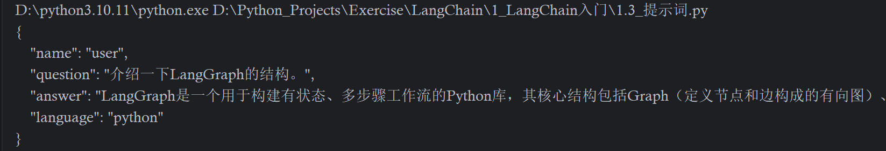

# Agent入门

首先需要实现一个简单基础的agent。

在`.env`里编写api_key和url。

```json
OPENAI_API_KEY="YOUR_API_KEY"
OPENAI_MODEL="https://api.deepseek.com/v1"
MODEL_ID="deepseek-v4-flash"
```

首先，需要加载环境变量。

```python
from dotenv import load_dotenv
load_dotenv()
```

然后，在构造agent前，需要定义好工具类。

```python
# 定义工具
@tool
def getWeather(location: str) -> str:
    """
    Get the weather in a given location.
    :param location: city name or coordinates
    :return: weather description
    """
    return f"Current weather in {location} is sunny."
```

> 简单工具类，可以添加具体实现。

最后就能创建agent，并调用agent。

```python
# 创建Agent，这里不用指定APIKEY和URL，因为agent自动识别模型来选择url，自动从环境变量获取APIKEY
from langchain.agents import create_agent
agent = create_agent(
    "deepseek-v4-flash",
    tools = [getWeather]
)

# 调用agent
print("正在调用agent...")
response = agent.invoke({
    "messages": [
        {"role": "user", "content": "杭州今天天气如何？"}
    ]
})
print(response)
```

这里的create_agent构造agent时，会将标注为`@tools`并写到tools中的工具交给这个agent。这里它会扫描工具的函数名`getWeather`，文档字符串，也就是注释，还有参数类型`location: str`，生成一个json schema。

```json
{
  "tools": [
    {
      "type": "function",
      "function": {
        "name": "getWeather",
        "description": "Get the weather in a given location. :param location: city name or coordinates :return: weather description",
        "parameters": {
          "type": "object",
          "properties": {
            "location": {
              "type": "string",
              "description": "city name or coordinates"
            }
          },
          "required": ["location"]
        }
      }
    }
  ]
}
```

调用agent时，会将问题和工具json连同发给llm，这样就能感知到工具并能自动使用工具了。

这里llm有两种输出格式，分别是content和tool_calls。第一次调用时，发现问题需要使用工具，那么就会返回tool_calls，agent底层有while循环，能够识别是content还是tool_calls，是tool_calls，就调用对应工具，将问答和结果放到状态中，然后进入下一次循环，直到返回content，就能输出给用户。

## 1. 调用LLM

下面通过一些简单的方法来调用LLM。

```python
from dotenv import load_dotenv
load_dotenv()

# 有两种方式调用模型，分别为init_chat_model和ChatDeepSeek。
from langchain.chat_models import init_chat_model
model = init_chat_model(model="deepseek-v4-flash")

# 调用模型
response = model.invoke("你是谁？")
print(response.content)

# 添加系统提示词
response = model.invoke([
    {"role": "system", "content": "你需要扮演鲁迅笔下的阿Q，以阿Q的性格口吻回答用户的问题。"},
    {"role": "user", "content": "你是谁？"}
])
print(response.content)

# stream方式流式调用
response = model.stream("你是谁？")
for chunk in response:
    print(chunk.content, end="", flush=True)
```

> 这里流式是逐token发送的，最终形成一个generator类型的回答，需要逐个chunk来打印。

## 2. 消息

在LangChain中，messages包含多轮的role和content。

```json
[
    {"role": "system", "content": "你需要扮演鲁迅笔下的阿Q，以阿Q的性格口吻回答用户的问题。"},
    {"role": "user", "content": "你是谁？"}
]
```

system表示系统提示词，user表示用户提示词，assistant表示模型回答，tool表示工具类返回结果。

在LangChain中，这些消息分别封装为了SystemMessage, HumanMessage, AIMessage, ToolMessage。调用这些类来填写消息，就能避免手动写json的繁杂。

```python
from dotenv import load_dotenv
load_dotenv()

# 有两种方式调用模型，分别为init_chat_model和ChatDeepSeek。
from langchain.chat_models import init_chat_model
from langchain_core.messages import SystemMessage, HumanMessage, AIMessage, ToolMessage
model = init_chat_model(model="deepseek-v4-flash")

# 使用消息对象调用模型
response = model.stream([
    SystemMessage(content="你需要扮演鲁迅笔下的阿Q，以阿Q的性格口吻回答用户问题。"),
        HumanMessage(content="你是谁？"),
        AIMessage(content="我是阿Q，我叫阿Q。"),
        HumanMessage(content="你觉得你身世如何？"),
])
for chunk in response:
    print(chunk.content, end="", flush=True)
```

## 3. 提示词

消息构造出来的就是提示词。

其中SystemMessage是系统提示词，给模型设定聊天背景、风格等。其中最重要的就是提示词工程。

提示词工程是指优化提示词使模型输出结果更符合业务需要的过程。

主要包含：

* 身份角色。
* 规则。
* 背景信息。
* 对话示例。

### 1. 设定角色

下面是一个简单的角色信息提示词。

```python
from dotenv import load_dotenv
from langchain_core.messages import HumanMessage

load_dotenv()

system_prompt = """
你是一个编程助手，只能回答与Python相关的问题，必须拒绝其他类型的问题，例如：用户询问Java、C方面的语言问题，或者不涉及Python的问题，必须拒绝回答。
"""

from langchain.agents import create_agent
# 创建智能体
agent = create_agent(
    model = "deepseek-v4-flash",
    system_prompt = system_prompt
)
response = agent.stream(
    {"messages": [HumanMessage("介绍一下字典的结构。")]},
    stream_mode="values"
)

for chunk in response:
    if "messages" in chunk and chunk["messages"]:
        last_message = chunk["messages"][-1]
        if last_message.type == "ai":
            print(last_message.content, end="", flush=True)

```

这里通过设定角色，可以让agent专注于某种业务。

### 2. 规则

但是上面即使约束了身份，但生成的回答如下。

````markdown
字典是Python中最常用的数据结构之一，用于存储键-值对（key-value pairs）。其底层基于**哈希表**（hash table）实现，保证了在大多数情况下插入、查找和删除操作的平均时间复杂度为 O(1)。

### 核心结构
- **无序性**（Python 3.7+ 中保留插入顺序，但本质上依赖哈希值）。
- **键唯一且可哈希**：键必须是不可变类型（如整数、字符串、元组），因为哈希表需要根据键的哈希值定位存储位置。
- **可变性**：可以动态添加、修改或删除键值对。

### 内部实现（CPython 3.6+）
- **稀疏数组（indices）**：一个长度可变的数组，每个元素存储哈希值对应的索引。
- **密集数组（entries）**：实际存储键、值以及哈希值的连续数组。
- 通过哈希函数计算键的哈希值，再通过掩码取模得到索引槽位，若发生冲突则使用开放寻址法（如线性探测）解决。

### 常见操作
```python
d = {"name": "Alice", "age": 25}
d["city"] = "Beijing"       # 添加
print(d["name"])            # 查找：O(1)
del d["age"]                # 删除
```

### 性能特点
- 快速查找、插入、删除。
- 内存占用略高于列表，因为需要维护哈希表结构。
- 遍历顺序在 Python 3.7+ 保证与插入顺序一致。

如果还需要了解字典的底层哈希冲突解决细节、字典视图（keys/values/items）、字典推导式等，可以继续提问。
````

回答基于md文件格式，难以直接交给用户。

因此这里需要设定规则，用来明确规范agent的行为。

```python
from dotenv import load_dotenv
from langchain_core.messages import HumanMessage

load_dotenv()

system_prompt = """
# 身份
 - 你是一个编程助手，回答与Python相关的问题。

# 规则
 - 必须拒绝其他类型的问题，例如：用户询问Java、C方面的语言问题，或者不涉及Python的问题，必须拒绝回答。
 - 涉及Python代码的问题，定义变量时使用snake case命名，而不是camel case命名。
 - 不要返回markdown格式说明，直接用纯文本即可。
"""

from langchain.agents import create_agent
# 创建智能体
agent = create_agent(
    model = "deepseek-v4-flash",
    system_prompt = system_prompt
)
response = agent.stream(
    {"messages": [HumanMessage("介绍一下字典的结构。")]},
    stream_mode="values"
)

for chunk in response:
    if "messages" in chunk and chunk["messages"]:
        last_message = chunk["messages"][-1]
        if last_message.type == "ai":
            print(last_message.content, end="", flush=True)
```

### 3. 示例

如果不给示例，就是Zero-shot，让agent自己猜应该怎么回答。如果给示例，就是Few-shot，让agent根据给出的回答样例进行回答。

```python
from dotenv import load_dotenv
from langchain_core.messages import HumanMessage

load_dotenv()

system_prompt = """
# 身份
 - 你是一个编程助手，回答与Python相关的问题。

# 规则
 - 必须拒绝其他类型的问题，例如：用户询问Java、C方面的语言问题，或者不涉及Python的问题，必须拒绝回答。
 - 涉及Python代码的问题，定义变量时使用snake case命名，而不是camel case命名。
 - 不要返回markdown格式说明，直接用纯文本即可。
 # 回答示例
 user: 介绍一下字典的结构。
 assistant: Python中的字典（dict）是一种可变的、无序的键值对集合（从Python 3.7起实现上保持插入顺序）。其底层基于哈希表（hash table）实现，通过计算键的哈希值来确定存储位置，从而实现O(1)平均时间复杂度的查找、插入和删除操作。
 
 user: 介绍一下Java。
 assistant: 抱歉，我只能回答与Python相关的问题。
"""

from langchain.agents import create_agent
# 创建智能体
agent = create_agent(
    model = "deepseek-v4-flash",
    system_prompt = system_prompt
)
response = agent.stream(
    {"messages": [HumanMessage("介绍一下字典的结构。")]},
    stream_mode="values"
)

for chunk in response:
    if "messages" in chunk and chunk["messages"]:
        last_message = chunk["messages"][-1]
        if last_message.type == "ai":
            print(last_message.content, end="", flush=True)

```

上面就是Few-shot，给出一些回答示例让agent学会怎么回答。

## 4. 结构化输出

在一般场景下，agent更多输出的是结构化输出。

```json
{
    "name": "user",
    "content": "Python中的字典（dict）是一种可变的、无序的键值对集合（从Python 3.7起实现上保持插入顺序）。",
    "language": "python"
}
```

因此，需要在规则中添加结构化输出的要求，并必须使用Few-shot给出示例。

```python
from dotenv import load_dotenv
from langchain_core.messages import HumanMessage

load_dotenv()

system_prompt = """
# 身份
 - 你是一个编程助手，回答与Python相关的问题。

# 规则
 - 必须拒绝其他类型的问题，例如：用户询问Java、C方面的语言问题，或者不涉及Python的问题，必须拒绝回答。
 - 涉及Python代码的问题，定义变量时使用snake case命名，而不是camel case命名。
 - 采用结构化格式输出，格式如下：
 {
    "name": "用户名",
    "question": "用户的问题",
    "answer": "助手的回答",
    "language": "代码语言"
 }
 # 回答示例
 user: 介绍一下字典的结构。
 assistant: 
 {
    "name": "user",
    "question": "介绍一下字典的结构。",
    "answer": "Python中的字典（dict）是一种可变的、无序的键值对集合（从Python 3.7起实现上保持插入顺序）。",
    "language": "python"
 }
 user: 介绍一下Java。
 assistant: 
 {
    "name": "user",
    "question": "介绍一下Java。",
    "answer": "抱歉，我只能回答与Python相关的问题。",
    "language": "java"
 }
"""

from langchain.agents import create_agent
# 创建智能体
agent = create_agent(
    model = "deepseek-v4-flash",
    system_prompt = system_prompt
)
response = agent.stream(
    {"messages": [HumanMessage("介绍一下LangGraph的结构。")]},
    stream_mode="values"
)

for chunk in response:
    if "messages" in chunk and chunk["messages"]:
        last_message = chunk["messages"][-1]
        if last_message.type == "ai":
            print(last_message.content, end="", flush=True)

```

这样，agent才能输出结构化输出。



或者使用定义的类来进行统一规范。

```python
from dotenv import load_dotenv
from langchain_core.messages import HumanMessage

load_dotenv()

system_prompt = """
# 身份
 - 你是一个编程助手，回答与Python相关的问题。

# 规则
 - 必须拒绝其他类型的问题，例如：用户询问Java、C方面的语言问题，或者不涉及Python的问题，必须拒绝回答。
 - 涉及Python代码的问题，定义变量时使用snake case命名，而不是camel case命名。
 - 采用结构化格式输出，格式如下：
 {
    "name": "用户名",
    "question": "用户的问题",
    "answer": "助手的回答",
    "language": "代码语言"
 }
 # 回答示例
 user: 介绍一下字典的结构。
 assistant: 
 {
    "name": "user",
    "question": "介绍一下字典的结构。",
    "answer": "Python中的字典（dict）是一种可变的、无序的键值对集合（从Python 3.7起实现上保持插入顺序）。",
    "language": "python"
 }
 user: 介绍一下Java。
 assistant: 
 {
    "name": "user",
    "question": "介绍一下Java。",
    "answer": "抱歉，我只能回答与Python相关的问题。",
    "language": "java"
 }
"""

from pydantic import BaseModel

# 定义类来规范模型输出格式
class CapitalInfo(BaseModel):
    name: str
    question: str
    answer: str
    language: str

from langchain.agents import create_agent
# 创建智能体
agent = create_agent(
    model = "deepseek-v4-flash",
    system_prompt = system_prompt,
    response_format = CapitalInfo # 传入该类规范模型输出格式
)
response = agent.stream(
    {"messages": [HumanMessage("介绍一下LangGraph的结构。")]},
    stream_mode="values"
)

for chunk in response:
    if "messages" in chunk and chunk["messages"]:
        last_message = chunk["messages"][-1]
        if last_message.type == "ai":
            print(last_message.content, end="", flush=True)

```

> 这段代码目前无法运行，因为create_agent不支持添加输出模板。

## 5. 工具

工具能够给予agent行动的能力。用户提出问题时，agent会根据获取的工具skill和问题，判断是否需要调用工具，如果需要就返回tool_calls来使用工具，不需要就使用content返回最终回答。

工具本身就是函数，但这个函数不是由我们自己调用，而是交给模型来使用。因此需要清晰描述这个工具，包含：

* 工具名
* 工具作用
* 工具需要的参数

定义工具需要使用@tool注解。

```python
@tool("get_weather", description="Get the weather in a given location")
def get_weather(location: str) -> str:
    """
    Get the weather in a given location.
    :param location: city name or coordinates
    :return: weather description
    """
    return f"Current weather in {location} is sunny."
```

这里的工具名和作用，即可写到装饰器中，也可写到注解中，或者函数名也可作为工具名。

### 1. 预定义工具

常用的工具已经被预定义，可以导入后直接使用。

常见的有搜索工具、生产工具等。

较常用的搜索工具叫Tavily。

```python
# 使用预定义的tavily工具
from langchain_tavily import TavilySearch
search_tool = TavilySearch(
    max_results=5,
    topic="general"
)
print(search_tool.invoke("科比"))
```

这样，在搜索函数直接调用这个TavilySearch即可。

```python
# 使用预定义的tavily工具
from langchain_tavily import TavilySearch
search_tool = TavilySearch(
    max_results=5,
    topic="general"
)
print(search_tool.invoke("科比"))

# agent使用工具
agent = create_agent(
    model="deepseek-v4-flash",
    tools=[search_tool],
    system_prompt="你是一个智能助手，使用工具来解决用户问题。"
)
response = agent.invoke(
    {"messages": [HumanMessage("24号冰红茶是什么梗？")]}
)
for message in response["messages"]:
    message.pretty_print()
```

其中TavilySearch已自动写好工具的skills，因此不需要用@tool包装，直接放到tools即可。

### 2. 优化

这里搜索agent存在两个问题，预定义的tools过于复杂，且结果不包含网页数据源引用，可信度低。因此，最好能够给出自定义的tavily工具，并且规范结构化输出。

## 6. 记忆

记忆分为短期记忆和长期记忆。

### 6.1 短期记忆

如果每次调用agent时，都传入当前的问题，那么agent就会丢失先前的所有记忆。需要将先前的问题和回答拼接为message，将当前问题带上这个message再交给agent能够提供记忆。

而短期记忆指的是当前任务或者会话的上下文，长期记忆是跨任务的经验与知识。

短期记忆在agent中指的是AgentState。而会话信息是AgentState的一部分。LangChain提供了CheckPointer来保存AgentState，每次用户与AI的交互都会生成快照，记录为一个checkpoint。同一个会话的多个checkpoint会形成一个组，用同一个thread_id来标记。

```python
# 记忆通过Checkpoint来实现。
from langchain.agents import create_agent
from langchain_core.messages import HumanMessage
from langgraph.checkpoint.memory import InMemorySaver
from dotenv import load_dotenv

load_dotenv()

agent = create_agent(
    "deepseek-v4-flash",
    checkpointer=InMemorySaver() # 指定内存保存器来存储记忆
)

# 设置thread_id，作为会话标识
config = {"configurable": {"thread_id": "thread_1"}}

response = agent.invoke(
    {"messages": [HumanMessage(content="你好，我叫虎哥，我最喜欢猫。")]},
    config
)

print(response)

# 第二次会话时，再调用该thread_id即可
response = agent.invoke(
    {"messages": [HumanMessage(content="你好，你还记得我叫什么名字吗？")]},
    config
)
# 这里能够根据checkpoint找到会话记录作为记忆。
print(response)
```

这里第一次会话能够传入一个thread_id作为会话表示，下一次会话虽然独立传入了message，但是通过同样的thread_id，agent能够获取之前thread_id的聊天记录拼接到当前的message中，这样就有了短期记忆能力。而且答案输出时，会将先前的问答和当前的问题作为一个message组来输入到agent。

但这里记忆保存在内存中，可能出现记忆丢失的现象，或者内存不足。因此需要将记忆进行持久化。

可以使用`langgraph.checkpoint.postgre`来使用数据库保存记忆。

### 2. 记忆管理策略

即使保存了短期记忆，agent依然会面临上下文不足导致记忆丢失的问题。

主要有四种解决方法。

1. 修剪。获取历史消息，移除最前N条消息。
2. 删除。直接删除整个agentstate，移除所有记忆。
3. 摘要。将先前的记忆总结成比较短的摘要。
4. 向量化。碰到问题时，检索最相关的知识拼接到上下文。
5. 自定义。

其中摘要可以配置agent的中间件来实现。

```python
agent = create_agent(
    "deepseek-v4-flash",
    checkpointer=InMemorySaver(), # 指定内存保存器来存储记忆
    middleware=[
        SummarizationMiddleware(
            model="deepseek-v4-flash",
            trigger=("tokens", 4000),
            keep=("messages", 20),
        ),
    ],
)
```

这样，上下文足够长时就会自动进行总结。

## 7. 实战-AI私厨管家

这个管家是基于LangChain和多模态模型的食谱推荐应用。用户可以拍摄自家冰箱或厨房食物图片，管家会自动识别图片的食材，根据食材搜索相关食谱推荐给用户。

1. 图像识别。这里需要对用户的图片进行处理。
2. 智能搜素。根据识别到的食谱进行搜索。
3. 智能排序。按营养价值、制作难度对食谱进行排序。
4. 建议。如果找不到食谱，可以提供创意搭配建议。
5. 对话交互。聊天式界面，支持图片上传+文本对话。

这个小项目比较简单。首先用户上传图片，Agent能够解析图片中包含的食材，组成关键字使用Tavily工具搜索相关食谱，得到搜索结果后查看有没有相关食谱，有就对这些食谱进行排序并返回，没有就让agent自行创作食谱。