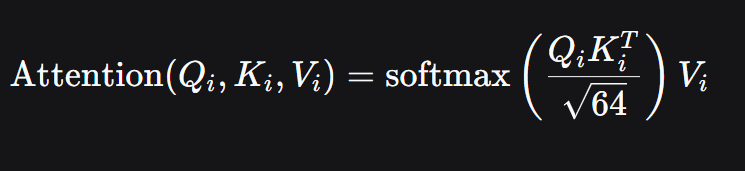
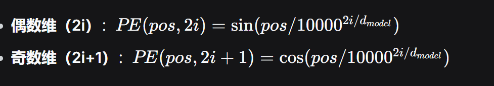
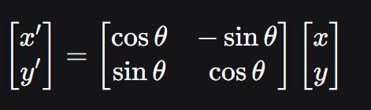
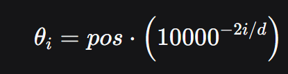
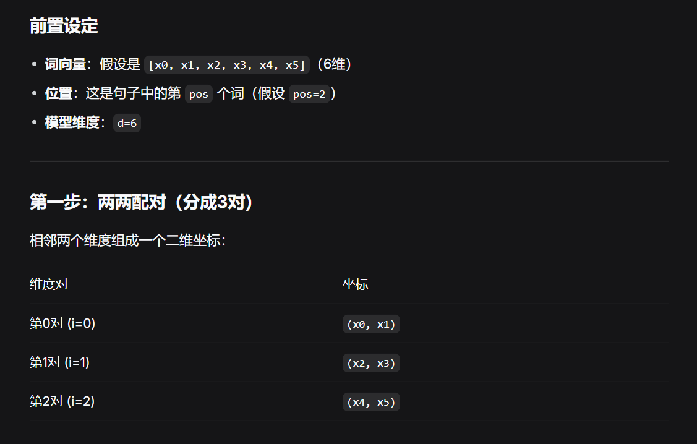
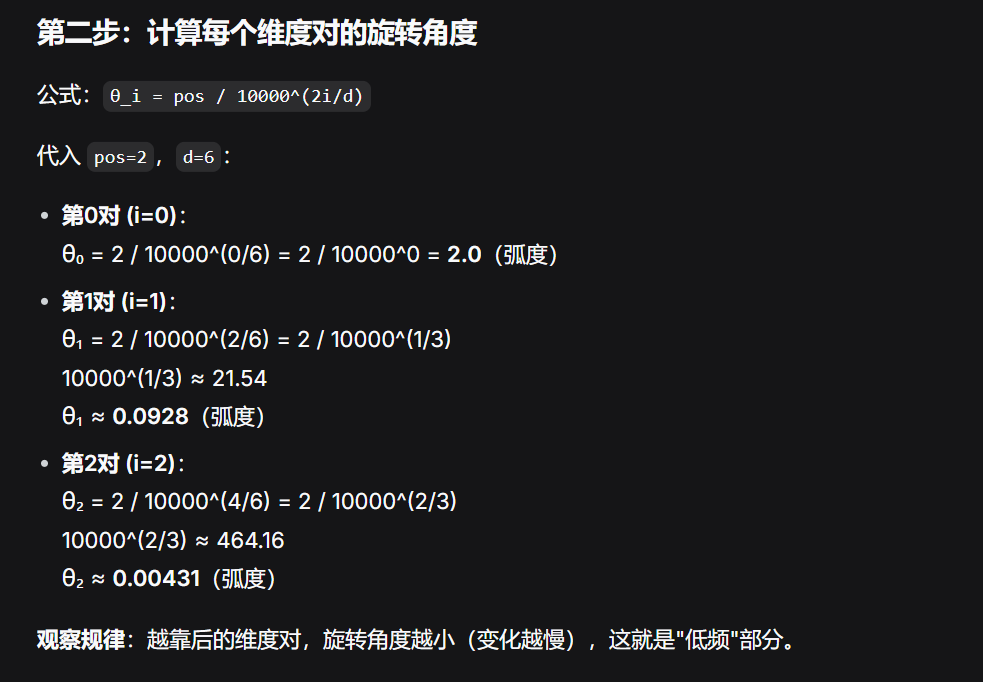
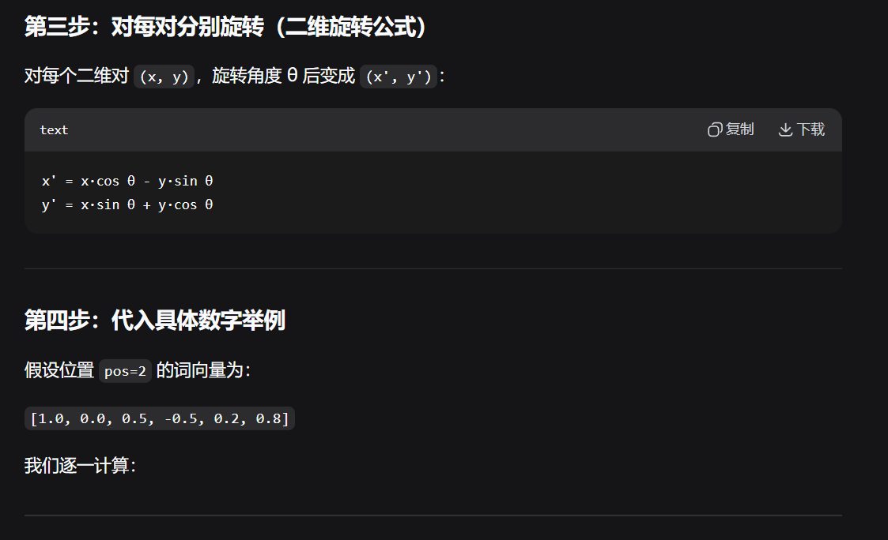
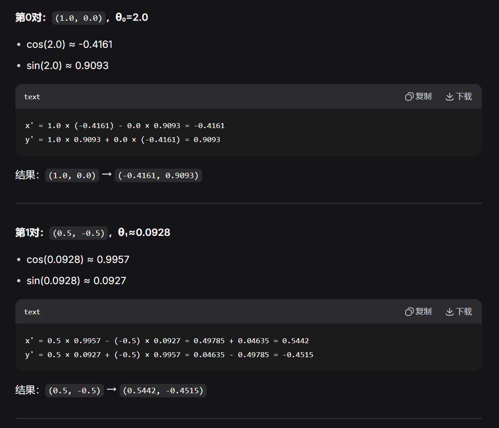
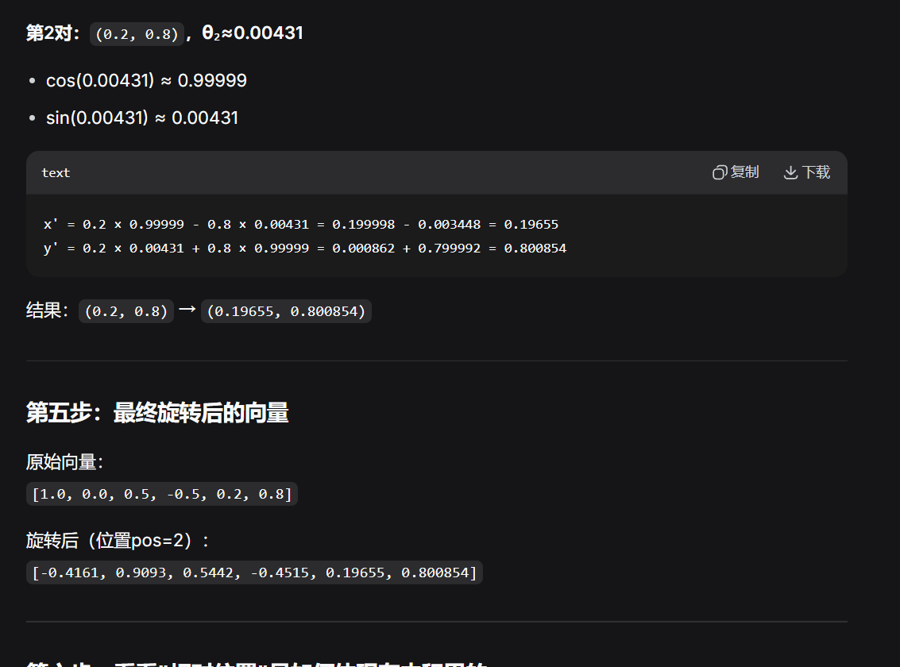
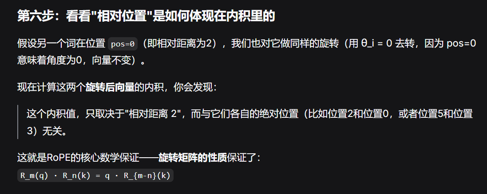

# 1. 什么是Transformer

Transformer是基于自注意力机制的序列到序列模型。

RNN的每个时间步都依赖上一个时间步的输出，无法利用并行的能力。而且RNN的长程依赖弱，如果序列很长，梯度反向传播容易消失或者爆炸。而LSTM虽然能够缓解长城依赖问题，但下一个时间步依然依赖上一个时间步，导致性能问题。

而Transformer能够通过自注意力机制，直接计算序列中任意两个位置的关联强度。

```
输入序列 -> Embedding + 位置编码
Encoder
Multi-Head self-Attention
Add & Norm
Feed-Forward Network
Add & Norm

Decoder
Masked Multi-Head Self-Attention
Add & Norm
Encoder-Decoder Cross-Attention
Add & Norm
Feed-Forward Network
Add & Norm

Linear + Softmax -> 输出概率分布
```

其中，多头注意力机制是在自注意力的基础上进行的。

## 1. 自注意力机制

自注意力能够让每个Token都能注意到其他Token。

首先，需要获取QKV矩阵。自注意力会将输入与可训练的W_Q, W_K, W_V矩阵分别进行乘积，就能得到Q、K、V。这样能够把输入映射到不同的表征空间，识别出输入的更多特征。

## 2. 多头注意力机制

自注意力机制虽然能够通过QKV来获取输入的多种特征，但仅通过一个头来观察输入，得到的输出会将里面的特征平均化，输出会变得平坦。因此可以通过多头注意力来解决这个问题，能够捕获更多的特征。

输入与W_Q, W_K, W_V相乘后分别得到Q，K，V，这里得到的QKV会在某个维度被平均划分，分别给每个头来进行计算。



经过这里的注意力公式计算后，就能得到一个注意力矩阵，所有头的注意力矩阵拼接后，注意力矩阵的形状与输入一致。这样再乘W_O来交换信息，再加上原始未经过QKV投影的矩阵X作为残差，然后经过层归一化，就能进入前馈神经网络，然后看情况交给下一个交叉注意力层，或者到解码器。

# 3. 位置编码

Transformer计算时使用的Attention(Q, K, V)公式中，没有考虑Token的位置，是基于内容的相似度计算。如果将Token的位置打乱，那么每个词和其他词的注意力分数计算方式完全一样。但语言的顺序是非常重要的。

因此，需要通过位置编码来添加位置信息。

## 1. 正弦余弦位置编码

一开始使用的是固定的公式。对于句子第pos个token，编码维度为i时，位置编码的计算方式为：



这样，位置越近，偶数维越小，奇数维越大。这样就能通过位置编码，表示token在句子中的位置。

## 2. 可学习位置编码

可以初始化一个位置嵌入矩阵，在训练过程中让这些数值进行梯度下降更新，让模型自主获取位置特征。

## 3. 相对位置编码

正弦余弦和可学习都是给出了绝对位置编码。并且将位置编码直接加到嵌入后的向量，导致原本的语义被破坏。且语义的相对距离更重要。

1. RoPE。旋转位置编码。通过旋转矩阵对Q和K向量进行旋转变化。这样，内积结果就包含了相对位置信息。

首先，RoPE的旋转是基于二维来进行的，因此需要将词向量维度进行拆分，两两配对。

然后定义一个角度单位theta，如果有一个二维向量[x, y]，将其逆时针旋转theta，那么[x', y']的计算公式如下。



其中，由于词向量两两配对，如512维的词向量，就会分为256对。那么假如当前计算的token的位置为pos，是第i对二维向量，那么旋转角度theta的计算公式如下。



然后接下来需要对Q和K进行旋转。假设第一个token在位置m，第二个token在位置n。

那么将q_m旋转m_theta，将k_n旋转n_theta，那么计算点积时，旋转后的q和旋转后的k的内积，等于原始q和原始k的内积再旋转角度(m-n)theta。这样，结果只和相对距离有关，和m、n的绝对距离无关。













## 4. 残差连接

残差连接就是将原始输入与处理后的结果加起来输入到下一个组件。

这个能够解决梯度消失和退化的问题。

### 1. 梯度消失

神经网络靠反向传播来更新参数，梯度在传递时会逐渐变小。有了残差连接后，能够保证反向传播时求导能够保持一个较大的数，缓解了经过多层后导数衰减的问题。

### 2. 退化

层数越多，能力应该越强。但现在层数越多，准确率反而可能会下降。那么如果这一层没有学到东西，只需要将权重调成0，输出依然是上一层的输出，至少不会变差。

# 4. Encoder和Decoder的区别

Encoder是双向的，Decoder是单向的。

Encoder如下。

```python
for layer in range(N):
    # 1. Multi-Head Self-Attention
    attn_output = MultiHeadAttention(
    	Q=x, K=x, V=x
    )
    x = LayerNorm(x + attn_output)
    # 2. Feed-Forward Network
    ffn_output = FeedForward(x)
    x = LayerNorm(x + ffn_output)
```

这里是双向注意力，能够并行处理所有Token
