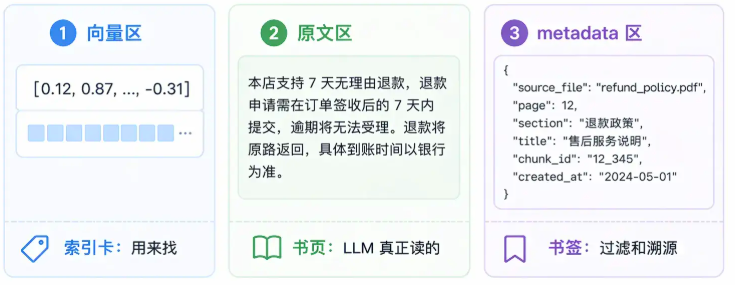

# 1. RAG是什么

RAG(Retrieval-Augmented Generation)是检索增强生成，是一种结合查找信息和生成答案的技术。先从外部资料找到相关信息，用这些信息来生成更准确的答案。

* 查找相关资料

用户提问后，系统使用工具在知识库中查找内容，可以基于关键字、语义或向量匹配的方式搜索。

* 生成答案。

把用户的问题和找到的资料交给一个模型，模型根据这些信息来写出最终答案。

# 2. RAG的优点

模型会根据获取的相关信息来回答问题，回答会更加真实，减少幻觉现象，而且知识在知识库中更新，不需要重新训练模型。在专业领域中，只需要更换知识库即可，适合医疗、法律、教育等领域。

主要解决了三个问题。

1. 知识时效性。LLM训练完毕后，知识就固定下来了，训练后的知识它不会知道。
2. 还有私有知识，一些专有数据集可能没有进入训练集，大模型不知道。
3. 幻觉问题，如果没有相关知识，大模型可能会自己编一个合理的答案。

RAG可以动态地更新知识。新的知识可以直接存入数据库，LLM检索时就可以知道最新消息。LLM部署到公司中，可以将私有数据存入向量数据库，LLM也能获取消息。这样有了真实的知识，能够缓解幻觉问题。

# 3. RAG和传统大语言模型的区别

传统语言模型是像GPT-2、GPT-3一样，答案完全靠模型自己生成，通过大量文本训练将知识记到脑子里。这种模型的特点是所有知识都在模型内部，不能查找外部资料，如果要更新知识，需要继续训练。而如果问到模型没有的只是，模型会出现幻觉。

RAG是先查资料，再回答的模型。获取用户提问后，会在知识库中查找资料，更新知识只需要更新知识库即可。这样知识量会更大，回答更真实，更不容易出现幻觉。

# 4. RAG和微调的区别

微调通过调整模型参数来学习新知识，而RAG不修改模型参数，而是检索外部数据来注入知识，解决模型的知识更新较慢和幻觉的问题。

RAG主要是知识更新简单。但这种更新简单可能导致检索到的信息过多过杂，导致注意力分散，回答不到重点上。而且检索内容过多会导致Token消耗快。并且RAG只是拓展了获取信息的方法，不会修改大模型本身。

微调能够修改模型本身的状态。可以将一些知识需要的术语、代码或者语气等记忆到LLM内部。缺点就是微调成本高昂，而且如果知识源源不断地来，就要不断地进行微调。还有微调后的模型时根据记忆来生成文本的，记忆可能会出现幻觉的现象。

# 5. 为什么RAG能够缓解幻觉问题

RAG的生成结果基于检索到的真实文档，通过注意力机制能够将生成的内容约束到这些文档内，减少了虚构答案的可能。

# 6. 如何寻找相关文档

通过语义相似度或者关键词匹配，从知识库中筛选最相关的Top-K文档。

# 7. 主流的检索器有哪些

* 稀疏检索，如BM25，用来进行关键词匹配。
* 稠密检索，如DPR、Embedding等，通过嵌入向量来获取语义信息，通过语义相似度来检索。
* 混合检索，将稀疏检索与稠密检索混合起来。

# 8. 文档保存

文档整篇不能直接存入向量库，需要切成小块才能存入。因为向量模型输入有长度限制，大文档无法直接存入。而且将整个文档存入的话，文档里的信息会被平均掉，只能检索到笼统的信息，很多细节丢失了。

所以最好的方法时将原始文档进行切分，然后向量化，最后入库。

切分的话，整个文档会被切为一个个的chunk。

## 8.1 chunk

chunk保存了三个信息，向量、文本和元数据。

向量就是将文本嵌入后的向量，能够用来计算相似度。文本就是根据向量检索出来后，可以输入到模型中的内容，元数据是标签。保存这个文本的来源，如页码、章节等信息。



这里的划分也需要根据情况来划分，即粒度。粒度过大会导致压缩太多语义，导致信息被平均；太小会导致检索的时候内容太零散，如文本“他回来了”，这里缺失上下文信息导致不知道这个“他”是谁。这里用到文档分割策略。

1. 固定大小。按照字符数或者token数分割。方法简单，但可能在句子中间截断，破坏完整性。
2. 语义边界分割。首先按段落分，如果段落太多，就按句号、感叹号分，如果还是多，就按普通标点符号分。
3. 特殊内容分割。比如图片或者函数，需要完整保存，这时候就需要按函数或者类来分割。
4. 父子切割。这种方法最好，将多个chunk根据id范围组合作为父chunk，如果检索到某个chunk，就将整个父chunk拿出来。

# 9. 如何避免语义切割问题

1. 重叠切割。在切分的时候，前后额外有一部分重复内容，避免某个句子恰好被分成两半。
2. 父子切割。chunk按照id顺序，组成父chunk，如果检索到子chunk，那么就返回整个父chunk。

3. 按照语义切割。根据段落、句号、感叹号等来切割。
4. 句子窗口检索。检索到某个chunk时，将这个chunk的相邻多个chunk都返回。
5. 上下文增强切分。切割后通过大模型为当前chunk补充全局背景。

# 10. Embedding

Embedding用来压缩语义，将文本映射程固定长度的浮点数向量。比如1020维的Embedding模型，嵌入文本的向量都是1024维的列表。

Embedding的特点是语义相似的文本，向量余弦相似度高。

OpenAI有text-embedding模型，国内有bge-large-zh的模型，还有Qwen-embedding模型。Chroma使用的是SentenceTransformer的all-Minilm模型。

## 10.1 模型选择

如果以中文为主，可以用bge或者qwen。如果英文多，可以用text-embedding。

如果数据有要求，就要部署本地的开源模型，如BGE系列。

维度越高越准确，但时间成本增加。1024是一个比较好的节点。

## 10.2 算法

1. 静态词向量，如Word2Vec。单词被嵌入后，向量不会随着上下文的改变而改变。导致“吃了苹果”与“苹果公司”的苹果二字嵌入向量一致。
2. 上下文相关向量，如BERT。用transformer来生成嵌入向量。
3. 句子对比学习，如SBERT和BGE。SBERT解决了BERT需要同时输入两个句子来分析差异的问题。

# 11. 向量数据库

普通的关系型数据库是用来精确匹配的，存入的是什么信息，取出来的就是什么。然而现在有大量非结构化数据，难以存储。可以讲这些非结构化的数据转化为向量，然后存储到向量数据库。它通过算法来计算向量之间的空间距离来获取语义上最接近的内容。

如果是小规模项目，使用Chroma比较好。轻量级，在代码里面就可以直接导入，不需要启动服务器。

如果规模较大，可以使用Qdrant性能比较好。

超大规模的可以用Milvus。

## 11.1 向量数据库算法

数据库检索使用的是近似最近邻搜索。给出查询向量，在库里找到最相似的K个向量，返回这些向量的原始内容。

## 11.2 索引算法

HNSW。构建多层级的图，自顶向下节点越来越多。首先从最顶层寻找相关节点，然后到中层的对应位置查询新的相似节点，最后在底层的某一部分中查找到目标。

IVF。对向量做聚类，把相似的向量放到一个桶，查询时只查询最相似的桶。

# 12. 使用RAG的流程

将问题输入到RAG系统的话，会经过检索、整理、生成的过程。

首先对问题进行预处理，将问题进行向量化，从向量数据库找出最相关的文档片段，将筛选出来的片段与问题组成提示词交给大模型，大模型就能根据这些背景和问题来回答。

# 13. 向量检索和关键词检索的区别

向量检索是语义匹配，计算向量之间的相似度来提取语义相关的数据。语义理解能力强，但对精确词汇不敏感。

关键词检索就是用来解决精确匹配的问题。采用的是倒排索引，记录每个token出现在哪些文档中。这样，用户输入被分割之后，根据关键词检索就能快速获取文档，而不需要查看文档的内容。

# 14. 如何对问题预处理

用户的提问充满噪音或者错别字。比如“她是谁”，这里的她需要根据上下文来推断。可以使用一个语言模型，通过历史会话来获取上下文，将用户的输入改写为完整的，正式的问题。

还有一种方法是HyDE。问题的向量和答案的向量相似度并不高。为了解决这个问题，用户提出问题并改写后，大模型首先根据问题写出一种答案，然后根据答案来在数据库检索数据。因为答案与答案之间的向量相似度会更高，所以检索的准确度也会提升。

# 15. 多路召回

一般来说，根据用户的问题来检索数据库，能够检索出一类数据。但如果检索方法不对，或者不全，可能导致检索到的信息不够。因此可以使用多路召回。多路召回就是同时使用不同的算法来检索数据，最后将检索到的数据合并到一起。

现在主要是三路召回。

1. 向量检索。也就是稠密检索，负责语义相关的检索。
2. 关键词检索，也就是稀疏检索，将与关键词相关的文档检索出来。
3. 多Query拓展，将用户的输入进行改写，用新的输入来进行检索。

单路召回最主要就是对精确词语的召回效果差，比如寻找某个型号的手机，可能会把相近型号的手机全给找出来。

获取多路检索结果，通过RRF算法来合并结果。

RRF是看文档在向量检索和关键词检索的分数排名。如果在两个检索中排名都很高，那么记录这个文档，选取一定数量就返回。

# 16. 检索优化

RAG可能出现检索效果不好的问题。可以从索引层、查询层、召回层、重排序层来进行优化。索引层决定知识怎么存，查询层决定问题怎么改写，召回层决定知识从哪找，重拍徐层决定怎么从检索结果里挑选。

# 17. RAG总系统

RAG是检索增强生成，用来解决LLM知识不实时、重新训练成本高的问题。用户输入问题后，先经过RAG检索，获取最相关的多个数据，让LLM根据这些数据来回答，避免出现知识不够、出现幻觉的问题。

下面是RAG的主要流程。

* 用户输入问题。
* 问题预处理/改写/识别意图。
* Retriever检索器检索。
* 从数据库检索相关知识。
* 获取候选文档Chunks。
* 重排Reranker。
* 上下文组装。
* 输入到LLM生成回答。
* 标出引用来源、置信度等。

RAG能够很容易地解决LLM知识不足的问题，但RAG依赖知识准确度和检索准确度，如果检索不够精确，或者知识有误，依然会出现问题。

RAG包含六层。

* 数据层。数据来源可以是PDF、Word、MD等格式。
* 处理层。有文档解析、清洗、去重、分块等。
* 索引层。包含Embedding模型、稠密向量、洗漱向量、混合索引等。
* 检索层。有Top-K检索、语义检索、关键词检索等。
* 生成层。包含Prompt模板、上下文压缩等。
* 评估层。包含召回率、准确率、置信度等。

RAG的数据处理中，首先需要将文档加载到程序中。像PDF可以用PDF parser，Word可以结构化解析，HTML用爬虫，数据库用SQL查询等。这里的文件解析很重要，如果出错就会导致LLM无法查出数据，后面的都会受影响。

然后就是文档清洗。包含去除重复文本、取出页眉页脚、修复乱码、标出引用来源等。

接下来是文档分块。RAG不会将整个文档存到向量库，因为整个文档存储会导致生成的向量比较平滑，无法展现其中关键知识，稀释语义，而且Embedding也有输入长度的限制。所以需要将文档切分成多个chunk。切分也有多种方法。

| 分块方式     | 原理                           | 优点         | 缺点                 |
| ------------ | ------------------------------ | ------------ | -------------------- |
| 固定长度分块 | 每N个token切一块               | 简单         | 容易切断语义         |
| 滑动窗口分块 | chunk之间保留部分overlap       | 减少语义断裂 | 有重复部分，存储量大 |
| 俺标题分块   | 根据md文件或者html的标题来划分 | 保留结构     | 只对部分类型有效     |
| 语义分块     | 根据语义边界切分               | 质量较高     | 实现复杂             |
| 句子划分     | 按句子或者段落划分             | 精细         | 上下文短             |
| 父子切块     | 检索到子块，整个父块都要加载   | 召回精确     | 实现复杂             |

> 一般来说，中文知识库可以用500token来进行划分。overlap通常为20%。如果是QA，可以每个QA来进行划分。代码文件按照方法、类等进行划分。

如果RAG检索到了数据，返回时需要遵循元数据的格式。

一般的返回格式如下。

```json
{
    "source": 文档来源,
    "title": 文档标题,
    "section": 章节,
    "page": 页码,
    "url": 链接,
    "created_at": 创建时间,
    "updated_at": 更新时间,
    "author": 作者,
    "deparement": 部门,
    "language": 语言
}
```

这里的元数据可以用来进行筛选。如果想要2025年之后的，可以对时间进行限制。

然后就是嵌入Embedding。作用是将文本、图片等转化为向量，向量之间的距离表示语义相似度。而嵌入有多种方式。

1. 稠密向量，检索策略为Dense Retrieval。

每个维度都是浮点数，能够理解语义，处理改写文本和同义词。但这种方式对精确匹配不敏感，如“开心”和“快乐”能够同时检索出来，但对于精确检索“开心”来说，“快乐”是不必要的。

这种稠密向量适用于知识库检索、语义搜索等。

2. 稀疏向量，检索策略Sparse Retrieval。

如BM25、BGE-M3，以所有词的数量为长度构建向量，哪个词出现就在对应token上加1。

这种方法能够精确匹配关键词，对错误码、函数名、人名等检索很有效。

3. 多向量Hybrid Search。

传统的embedding会将一个chunk压缩为一个向量。但多向量方法可以将一个文档表示为多个向量。

这种方法召回率会更佳，但存储翻倍。

Embedding嵌入时，需要选择对应的嵌入模型。

选择模型时，应该考虑是否支持中文、上下文长度、向量维度、推理速度等方面。

| 类型          | 代表             | 特点                |
| ------------- | ---------------- | ------------------- |
| 通用Embedding | OpenAI Embedding | 效果强，API调用方便 |
| 开源中文      | BGE、ES          | 可本地部署          |
| 代码Embedding | CodeBERT         | 适合存储代码        |

检索的时候，需要考虑多种相似度。

| 指标       | 描述         | 特点                 |
| ---------- | ------------ | -------------------- |
| 余弦相似度 | 看向量的夹角 | 最常用               |
| 点积缩放   | 看点积大小   | 用于归一化之后的场景 |
| 欧氏距离   |              | 传统向量任务         |
| 曼哈顿距离 | 绝对距离     | 少见                 |

而Embedding模型通常内置最适合的相似度指标，不应随意更换。

检索的时候，有精确检索和近似检索。

1. 精确检索KNN。

将query向量和所有文档逐个计算距离，返回最接近的K的chunk。

这种方式最准确，但如果文档数量过大，会非常耗时。

2. 近似检索。

近似检索使用的是ANN。

最常用的就是HNSW，将所有节点进行分层，最底层包含所有节点，上一层包含一些代表节点，检索到代表节点时，接下来就是检索这个代表节点连接的下一层的所有节点。让query与这些代表节点进行匹配，只考虑最接近的节点下连接的节点，然后在这个类中继续匹配其中的代表节点，只考虑代表节点的类，以此类推。

HNSW有三个参数，M是每个代表节点连接多少个子节点。越大召回率越高。efConstruction构建节点的搜索宽度，越大索引质量越高。efSearch查询时搜索宽度。越大召回率越高。

向量存储时，需要考虑向量数据库的类型。

1. Chroma。

轻量级向量数据库，文档可以存储embedding、metadata，以及文本和图片检索。

有点事上手简单，本地持久化方便，但大规模分布式能力差，针对权限设置、海量数据治理能力弱。

2. Milvus。

更偏向高性能、大规模分布式检索。采用的是微服务化架构，系统分为查询节点、数据节点、索引节点，数据持久化依赖OSS，虽然部署繁琐，但拓展能力强。

3. Qdrant。

Qdrant由Rust编写，即保证了如Chroma的简单使用方式，又保证了高性能、分布式、大数据的表现。这里一个数据可以嵌入为多个向量，如稠密向量和稀疏向量，这样Qdrant底层检索就会通过多方面的检索方式组合检索，得到更符合的结果。

检索之前，可能需要为用户的提问进行优化，也就是QueryTransformation。

1. 问题改写。

首先将用户的问题改写成更适合检索的问题。

```
用户问：“这个怎么弄”
改写后：“Spring Boot中如何配置Redis分布式锁”
```

这种改写需要使用历史上下文来推理。

2. 问题拓展。

使用多个相关术语来拓展用户的问题。

```
“如何优化RAG”
变为：
“如何提升RAG召回率”
“如何降低RAG幻觉”
“如何优化RAG延迟”...
```

这样召回更全面，但成本增加。

3. HyDE。

针对用户的提问，首先让LLM先回答出一个可能的答案，再用这个可能的答案来做检索。

4. 问题拆分。

用户的问题可能比较大，需要拆分成多个子问题。

```
"RAG和微调的区别是什么，企业客服应该选择哪个"
拆分为：
“RAG是什么”
“微调是什么”
“两者的优缺点是什么”
“企业客服知识更新频率如何影响选型”
```

5. 问题路由。

知识库可能会按照专业来拆分，如金融知识库、计算机知识库、生物知识库等。需要根据问题的类型首先路由到对应的知识库再寻找。

检索到文档后，需要合理地将文档放到上下文。主要的策略有多个。

1. Top-K控制。

首先检索一定数量的数据，如K_1个，然后选择其中最相关的K_2个放入到上下文。这样能够减少上下文长度。但K需要合理，太小会漏掉答案，太多会影响推理。

2. MMR多样性检索。

如果只关注相关性，最终得到的可能是大量重复的内容。因此MMR引入了惩罚机制，降低了与已选文档相关的文档分数，让最终文档包含了查询的最优解，又包含了不同角度。

3. Context Compression。

将检索结果压缩成更短的上下文。可以通过筛选句子、LLM摘要压缩等方法实现。

4. 引用。

将文档放到上下文时，需要标注来源，能够让用户验证。

5. 冲突处理。

如果多个文档相互冲突，需要优先选择最新版本，或者权限更高的文档。

放到上下文后，需要按需设计prompt。

Prompt包含下面的部分。

```
角色
任务
用户问题
检索上下文
回答格式
约束条件
拒绝回答规则
引用要求
```

```
你是企业知识库助手。
请只根据提供的上下文回答问题。
如果上下文中没有答案，请回答“资料中未找到明确依据”，不要编造。
回答必须包含引用来源。

用户问题：
{question}

上下文：
{context}

请输出：
1. 直接答案
2. 依据
3. 引用来源
```

原则就是让LLM只基于上下文来进行回答，明确不可编造，而且通过引用来区分事实和推理。

RAG也需要进行优化，六层都有对应的优化方法。

1. 数据层

如果文档质量不好，重复、过时、丢失，需要通过数据清洗、去重、版本控制等方法来提高质量。

2. 切块优化

如果切块太大或者太小，需要调整chunk的size、overlap，或者切换切块规则，如按段落切块、语义切块、父子切块等。

3. Embedding优化

如果召回差，需要更换embedding模型。 如多语言的模型，或者使用混合检索。

4. 检索优化

出现召回不全的问题，需要提高Top-K，或者问题改写、拓展、HyDE等。

5. 上下文优化

检索到的文本太多，放不到上下文，可以使用上下文压缩、MMR去重。

6. 生成优化

让LLM严格按照检索的内容回答，没有就说不知道，并给出引用。

RAG也需要评估准确性，有多个指标可以评估。如Recall@K，看正确文档是否出现在TopK中，Precision@K，TopK有多少是相关文档，MRR，第一个正确结果排第几等。

计算召回率，首先需要构建评估数据集，数据集包含Query和必须参考的ChunkID，输入到RAG中，查看RAG检索出来的TopK个Chunk，计算命中参考CHunkID/K就是召回率。

或者可以让LLM作裁判，根据Query得到的检索内容与事实进行比对，给出相关分数。

下面是一些可能出现的问题。

1. 检索不到正确文档。

可能是文档没有入库。

chunk切割了语义。

Embedding模型不适用中文。

Topk太小。

稠密检索和稀疏检索没用好。

2. 检索到了回答错。

chunk在TopK中排名后，优先级低。

上下文过长，噪声太多。

LLM没有遵循上下文。

prompt没写好。

文档存在冲突。

3. 回答总是资料未找到。

召回率低。

Chunk太小导致提取不了数据。

用户问题涉及同义词。

4. 系统太慢。

向量库索引没优化。

TopK太大。

上下文太长。

而RAG也存在安全问题，比如文档可能有提示词注入攻击，因此需要告诉模型检索内容是不可信资料，并文档入库前需要做安全扫描。

如果RAG回答错了，首先需要看文档是否入库，解析方法是否合适，chunk是否分块合理，embedding模型是否合适，检索是否命中，context是否包含答案，prompt是否写对，大模型输出是否有引用等。