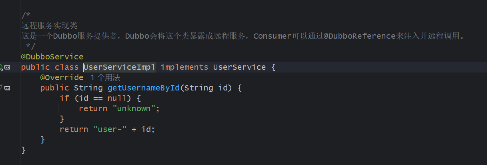
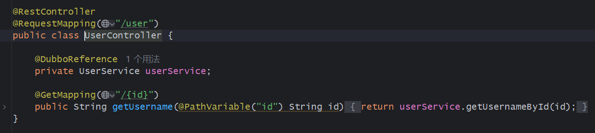

# 1. Spring FrameWork

Spring Framework是Spring的基础。包含IOC、AOP和事务。

## 1. IOC

ICO是控制反转，思想是对象不由程序员手动new出来，而是让Spring容器自动创建、管理、装配和销毁。

Spring的写法如下。

```java
@Service
public class UserServiceImpl implements UserService {}
```

其他地方可以直接注入。

```java
@RestController
public class UserController {
    private final UserService userService;
    // 构造器注入
    public UserController(UserService userService) {
        this.userService = userService;
    }
}
```

控制反转的好处是解耦，Controller不用关心哪个文件实现了UserService，只需要直到有UserService接口即可，由Spring统一管理。

## 2. DI

依赖注入是IOC的实现方式。常见的注入方式有构造器注入、Setter注入和字段注入。

构造器注入是最好的，不依赖Spring框架，单元测试能够直接测试。

```java
@Service
public class UserServiceImpl implements UserService {

    private final UserMapper userMapper;

    public UserServiceImpl(UserMapper userMapper) {
        this.userMapper = userMapper;
    }
}
```

Setter注入适合部分依赖注入。

```java
@Service
public class UserServiceImpl implements UserService {

    private UserMapper userMapper;

    @Autowired
    public void setUserMapper(UserMapper userMapper) {
        this.userMapper = userMapper;
    }
}
```

最后是字段注入。

字段注入依赖注解，单元测试的时候依赖于Spring框架，导致单元测试复杂。

```java
@Autowired
private UserMapper userMapper;
```

## 3. Bean

Spring容器管理的对象就是Bean。

常见的Bean声明有@Component, @Repository, @Service, @Controller, @Bean。

默认的Bean作用域是Singleton，多次注入采用同一个实例。

prototype每次注入都会使用新对象。

request在每个HTTP请求都会创建实例。

session在每个会话创建实例。

Bean通常无状态，但如果有内置状态，多个方法注入该Bean也会出现线程安全问题。

Bean的生命周期如下。

* 实例化对象。
* 填充属性。
* 执行Aware回调。
* 执行BeanPostPrecessor前置。
* 执行初始化。
* 执行BeanPostPrecessor后置。
* Bean可用。
* Bean销毁。

## 4. Spring 容器

BeanFactory是Spring的基础容器，提供简单的IoC和DI功能。

ApplicationContext是增强版，提供国际化、事务发布、环境配置、自动扫描等功能。

## 5. 配置方式

传统的Spring使用XML来配置Bean对象。

```xml
<bean id="userService" class="com.example.UserServiceImpl"/>
```

现代的Spring使用注解来实现。如@Service。

Spring Boot通过自动配置和application.yaml来配置。

```yaml
server:
	port: 8080
spring:
	datasource:
		url: jdbc:mysql://localhost:3306/demo
		username: root
		password: root
```

# 2. Spring AOP

AOP是面向切面编程。用来将与实际业务无关的逻辑从业务代码中提取出来，实现代码复用和功能增强。

例如每个业务都有下面的逻辑。

```java
public void createOrder() {
    // 记录日志
    // 校验权限
    // 开启事务
    // 执行业务
    // 提交事务
    // 记录耗时
}
```

那么每个方法都会非常冗余。通过AOP可以将这些公共逻辑抽取出来。

## 1. AOP概念

切面Aspect是横切逻辑的定义。

连接点Join Point是增强的位置。

切点 Pointcut指什么方法需要被增强。

通知Advice是增强逻辑，如方法前、方法后、异常时、环绕。

## 2. AOP示例

```java
@Aspect
@Component
public class LogAspect {
    @Around("execution(* com.example.service..*(..))")
    public Object logTime(ProceedingJoinPoint joinPoint) throws Throwable {
        long start = System.currentTimeMillis();
        try {
            return joinPoint.proceed();
        } finally {
            log cost = System.currentTimeMillis() - start;
            System.out.println(joinPoint.getSignature() + "耗时：" + cost + "ms");
        }
    }
}
```

这段代码拦截了com.example.service包下的所有方法，在joinPoint.proceed()中运行完毕后，统计了计时。

## 3. 通知类型

@Before方法执行前。

@After方法执行后。

@AfterReturning方法正常返回后。

@AfterThrowing方法抛出异常后。

@Around环绕通知。

## 4. 代理

AOP有两种代理方式。

1. 如果目标实现了接口，那么可以使用JDK动态代理。通过接口来实现代理。
2. 如果没有接口，那么使用CGLIB来通过继承实现代理。

其中，final修饰的类和方法不能被CGLIB代理。

# 3. 事务

事务用来保证一组操作要么同时成功，要么同时失败。

事务有四个特性。

* 原子性。
* 一致性。
* 隔离性。
* 持久性。

## 1. 声明式事务

通过@Transactional注解在方法开始前开启事务，方法成功后提交事务，方法异常时回滚。

事务传播主要有七种。

1. 加入当前事务。

* REQUIRED。如果当前有事务，就加入，没有就另开事务。
* SUPPORT。如果有事务就加入，没有就非事务运行。
* MANDATORY。有事务就加入，没有就报错。

2. 不加入当前事务。

* REQUIRED_NEW。不关有没有事务都开启新事务。
* NESTED。开启嵌套事务。
* NOT_SUPPORED。有事务就挂起。
* NEVER。必须非事务，有事务就报错。

## 2. 编程式事务

通过编写代码，如TransactionTemplate在代码中显式控制事务的开启、提交和回滚。

## 3. 隔离级别

* 读未提交。可能脏读。
* 读已提交。只读取已提交的数据。在每次SELECT时开启MVCC快照读。
* 可重复读。在第一次SELECT时开启MVCC快照读，后续的快照读都在这个快照中读取。
* 串行化。事务不能并发。性能低。

## 4. 回滚规则

事务不是遇到任何异常都会回滚。

通常只会对RuntimeException和Error进行回滚，对CheckedException不会回滚。因为受检异常必须通过trycatch或者throws进行处理，默认代码本身能够解决这个异常，就不会回滚。

如果需要对受检异常回滚，那么需要指定rollbackFor=Exception.class来为所有异常回滚。

## 5. 事务失效场景

1. 方法非public。事务需要创建代理对象，私有方法在外部不可见，所以不会生效。
2. 同类内部调用。同类内调用时，调用的是this指向的自己的方法，也就是原始对象的方法，没有经过事务增强。
3. 异常被捕获。事务方法内异常被捕获，默认认为异常已妥善处理，不会触发回滚。
4. 受检异常。
5. 事务传播选择了非事务运行。
6. 使用MyISAM等不支持事务的引擎。

# 4. Spring Boot

Spring Boot时基于Spring Framework的快速开发框架，减少配置来更快搭建可运行项目。

传统的Spring需要大量的XML配置，如Tomcat，JSON转换器，数据源等。

Spring Boot能够通过自动配置和starter类来自动实现配置。

例如`spring-boot-starter-web`会添加Web开发、AOP、JDBC、Redis、test等依赖，不需要用户手动配置。

## 1. 启动类

启动类需要被SpringBootApplication注解修饰。这个注解包括SpringBootConfiguration, EnableAutoConfiguration, ComponentScan三个注解，分别为配置、开启自动配置和组件扫描。

EnableAutoConfiguration将启动类的包作为基础包，能够扫描当前包下的所有Bean。

## 2. 配置文件

配置文件写在resources下的application.yml中。

可以配置多环境。

```yml
spring:
  profiles:
    active: dev
```

这样可以选择启动application-dev.yml, application-test.yml, application-prod.yml等环境。

```yml
server:
  port: 8080

spring:
  application:
    name: user-service
  datasource:
    url: jdbc:mysql://localhost:3306/demo?useUnicode=true&characterEncoding=utf8
    username: root
    password: 123456
```

配置信息会被自动读取。可以通过@Value读取，或者对一个类使用@ConfigurationProperties(prefix="app")注解，通过注解能够将app下的配置信息使用getter和setter注入到类中的同名成员变量。

或者直接注入Environment类型的对象，通过env.getProperty("app.name")能够获取属性。

# 5. Spring MVC

Spring MVC时Web框架，负责接收HTTP请求、解析参数、调用Controller，返回JSON数据或页面，用来与外部进行交互。

## 1. 流程

1. 浏览器发送HTTP请求。
2. 请求进入DispatcherServlet。
3. DispatcherServlet根据HandlerMapping找到对应的Controller方法。
4. HandlerAdapter调用Controller方法。
5. 参数解析器解析请求参数。
6. Controller调用Service。
7. Service返回结果。
8. HttpMessageConverter将Java对象转化为JSON。
9. 返回HTTP响应。

## 2. 示例

```java
@RestController
@RequestMapping("/users")
public class UserController {

    private final UserService userService;

    public UserController(UserService userService) {
        this.userService = userService;
    }

    @GetMapping("/{id}")
    public UserVO getUser(@PathVariable Long id) {
        return userService.getUserById(id);
    }

    @PostMapping
    public Long createUser(@RequestBody CreateUserRequest request) {
        return userService.createUser(request);
    }
}
```

## 3. 请求映射

* RequestMapping。通用请求映射路径。
* GetMapping。接收GET请求，用于查询。
* PostMapping。新增数据。
* PutMapping。整体更新。
* PatchMapping。局部更新。
* DeleteMapping。删除。

## 4. 参数注解

* PathVariable。路径参数，在路径中`@GetMapping("/api/users/{id}")`，通过`@PathVariable Long id`来实现注入。
* RequestParam。查询参数。如`@RequestParam("id") Long id`进行注入，访问路径通常为`"/api/users?id=10"`等。
* RequestBody。请求体JSON，前端请求带着JSON数据，直接注入到形参中。或者标记到Controller接口，这样返回的JSON数据能够直接交给前端。

## 5. Filter, Interceptor, AOP

Filter位于最外层，用于过滤，每个请求都会经过filter，能够在请求前和请求后做处理。主要用于跨域处理、请求包装等。

Interceptor位于中间，Filter处理完毕后Interceptor处理请求。这是拦截器，能够拿到Controller方法的信息，适合做登录校验、权限校验、接口日志等。

AOP是方法增强，能够切入其他方法，在其他方法前和后来做处理。通常用来开启事务、记录日志等。

## 6. 参数校验

Spring MVC可以通过spring-boot-starter-validation来做参数校验。

通过@NotNull和@NotBlank能够指定对应的字段要求。

## 7. 返回结果

通常Controller不会直接返回结果，而是通过统一的结构来进行封装。

```java
public class ApiResult<T> {

    private Integer code;
    private String message;
    private T data;

    public static <T> ApiResult<T> success(T data) {
        ApiResult<T> result = new ApiResult<>();
        result.code = 0;
        result.message = "success";
        result.data = data;
        return result;
    }

    public static <T> ApiResult<T> fail(Integer code, String message) {
        ApiResult<T> result = new ApiResult<>();
        result.code = code;
        result.message = message;
        return result;
    }
}
```

如果调用成功，就返回success方法，如果失败，就调用fail方法。

```json
{
  "code": 0,
  "message": "success",
  "data": {
    "id": 1,
    "username": "tom"
  }
}
```


## 8. Spring Task

定时任务通过Scheduled的cron来指定方法在什么时候调用。

如果运行多节点，每个节点都会运行同样的定时任务。此时可以用分布式锁来解决问题，如Redis，时间到了后首先从Redis通过SETNX设置锁，只有成功上锁的节点才能执行定时任务。而设置锁的时候，过期时间需要小于任务执行的周期，避免下一次定时任务到达时锁还在导致任务无法执行。

## 9. Spring Cache

这是Spring对缓存的抽象。底层可以接入Redis等。

启动缓存用EnableCaching注解。

在Service层中，通过Cacheable注解能够在调用Mapper前查看缓存，有数据直接返回，没有数据才访问Mapper。

```java
@Cacheable(cacheNames = "user", key = "#id")
public UserVO getUserById(Long id) {
    return userMapper.selectById(id);
}
```

在更新操作时需要删除缓存。

```java
@CacheEvict(cacheNames = "user", key = "#id")
public void updateUser(Long id, UpdateUserRequest request) {
    userMapper.updateById(...);
}
```

常用的注解时Cacheable，查询缓存。CachePut，执行方法，将结果放到缓存。CacheEvict删除缓存。Caching，混合多个缓存操作。

## 10. 缓存问题

1. 穿透。重复查询不存在的数据，导致每次都打到数据库。解决方法是缓存空值，或者使用布隆过滤器。

> 布隆过滤器有四个参数。预期插入的数据量n、误判率p、位数组大小m、哈希函数个数k。n和p需要根据业务选取，而m通过n×(-log2p)来选取，k通过(m/n)×ln2选取。

2. 击穿。热点key失效，导致大量请求打到数据库。解决方法是使用互斥锁，第一个请求到达时等待数据库更新，更新后才能获取，或者逻辑过期，请求到达时更新数据库，而请求直接返回过期数据。互斥锁保证一致性，逻辑过期保证高性能。

3. 雪崩。大量key同时失效，或者Redis宕机导致大量请求打到数据库。解决方法时设置过期时间时添加随机数，以及使用Redis集群保证高可用。

## 11. 数据库访问

常用的数据库访问技术有JDBC、JPA、MyBatis。

1. JDBC，Java原生API。

基本流程如下。

* 加载数据库驱动。
* 获取数据库连接。
* 创建Statement。
* 拼接SQL。
* 执行SQL。
* 处理结果集。
* 关闭Statement和Connection。

因为数据库链接成本很高，一般都会使用连接池。Spring Boot默认使用HikariCP。

```yml
spring:
  datasource:
    url: jdbc:mysql://localhost:3306/demo
    username: root
    password: 123456
    driver-class-name: com.mysql.cj.jdbc.Driver
    hikari:
      maximum-pool-size: 20
      minimum-idle: 5
      connection-timeout: 30000
```

即使不配置，它也有默认值，JDBC默认使用连接池，创建conn和statement时是从连接池获取对象，关闭时是归还到连接池中。

## 12. MyBatis

MyBatis是半自动ORM框架，在完成参数映射、结果映射、Mapper代理的同时，能够编写原生SQL。

编写Mapper的时候，直接编写接口即可。

```java
@Mapper
public interface UserMapper {

    User selectById(Long id);

    int insert(User user);
}
```

然后在mybatis-config.xml中找到这个接口，通过id指定方法，通过resultType指定返回类型，就能编写SQL。

```xml
<mapper namespace="com.example.mapper.UserMapper">

    <select id="selectById" resultType="com.example.entity.User">
        select id, username, age
        from user
        where id = #{id}
    </select>

    <insert id="insert">
        insert into user(username, age)
        values(#{username}, #{age})
    </insert>

</mapper>
```

其中，存在两种参数映射的方式。`#{}`使用PreparedStatement来进行注入，会替换为问号占位符，能够防止SQL注入。而使用`${}`的话是直接进行字符串拼接，使用Statement注入，会存在SQL注入风险。

其中，决定参数返回时，可以指定返回的类型。通过resultType能够直接指定返回的类型。而如果数据库字段名与对象属性名不匹配，可以通过resultMap来指定。

```xml
<resultMap id="UserResultMap" type="User">
    <id property="id" column="id"/>
    <result property="userName" column="user_name"/>
    <result property="createTime" column="create_time"/>
</resultMap>
```

编写SQL的时候也可以使用动态SQL。

```xml
<select id="listUsers" resultType="User">
    select id, username, age
    from user
    <where>
        <if test="username != null and username != ''">
            and username like concat('%', #{username}, '%')
        </if>
        <if test="age != null">
            and age = #{age}
        </if>
    </where>
</select>
```

```xml
<select id="selectByIds" resultType="User">
    select id, username, age
    from user
    where id in
    <foreach collection="ids" item="id" open="(" separator="," close=")">
        #{id}
    </foreach>
</select>
```

MyBatis有MyBatis-Plus增强版，Mapper不需要编写任何方法，就能够在Service中直接调用基础CRUD方法来修改数据库。

```java
@Service
public class UserService {

    private final UserMapper userMapper;

    public UserService(UserMapper userMapper) {
        this.userMapper = userMapper;
    }

    public User getById(Long id) {
        return userMapper.selectById(id);
    }
}
```

其中，selectById在UserMapper中没有编写。但这里需要符合命名规则，如selectById能够根据id查询，deleteByName能够根据名字删除等。

## 13. JPA

JPA是Java的ORM规范，常见实现是Hibernate。

在Repository，也就是Dao层中直接继承JpaRepository就可以拥有大量CURD方法，只需要在调用的时候保证命名规范即可。

如save()、findById()、findAll()等均可直接调用。

```java
public interface UserRepository extends JpaRepository<User, Long> {

    List<User> findByUsername(String username);
}
```

```java
@Service
public class UserService {

    private final UserRepository userRepository;

    public UserService(UserRepository userRepository) {
        this.userRepository = userRepository;
    }

    public User getById(Long id) {
        return userRepository.findById(id)
                .orElseThrow(() -> new BusinessException(1001, "用户不存在"));
    }
}
```

JPA的优点是CRUD很快，但复杂SQL较难实现，自动生成的SQL可能性能不好。

## 14. RESTful API

RESTful是接口设计风格，不是规范。

强调使用URL来表示资源，通过HTTP方法表示操作。

```
GET    /users          查询用户列表
GET    /users/{id}     查询单个用户
POST   /users          创建用户
PUT    /users/{id}     更新用户全部信息
PATCH  /users/{id}     更新用户部分信息
DELETE /users/{id}     删除用户
```

## 15. DTO, VO, Entity

Entity是数据库实体，与数据库的字段完整对应。

DTO是Data Transfer Object，为了减少接口调用次数设计的对象。通常在Service和Controller之间传输。比如用户的DTO可能还包含订单数量等来自其他表的字段。

VO是View Object，为前端设计的对象。Entity可能包含一些不可读的字段，需要经过格式化才能展示。以及敏感信息不应该传输到前端，所以数据库映射的时候，密码等敏感信息不会被注入到VO对象，自然不会暴露给前端。

## 16. 幂等性

幂等值同一个请求执行一次和多次，结果应该一致。

如用户重复点击删除订单和提交订单，应该保证只能删除一次和提交一次。

而GET、PUT、DELETE均幂等，只有POST非幂等。

因此，POST的时候可以获取一个唯一的Token，将Token存储到Redis中并设置过期时间，提交请求的时候携带这个Token，请求到达的时候检查Redis是否存在这个Token，存在就处理业务，不存在就拒绝请求。

## 17. 限流

常见的限流有多种。

1. 固定窗口。每分钟最多100次等。但两分钟的间隙中间能够瞬间打出200次请求。
2. 滑动窗口。最近1分钟最多100次请求。
3. 漏桶算法。请求到达时进入桶，桶以固定速度流出请求来处理。
4. 令牌桶。固定速度生成令牌，请求拿到令牌的时候才能执行，允许一定的突发流量。

## 18. 鉴权

鉴权分为两步，认证和授权。

认证时做登录、Token校验。

授权时给予用户权限。

1. Session认证。

用户登录后，服务端保存Session，浏览器保存Cookie。

客户端会向前端返回Session ID，浏览器发送请求时携带ID，后端就能获取当前登录用户的信息。

2. JWT认证。JWT是无状态Token。只要签发，永久有效。

JWT包含Header、Payload、Signature。

其中头部包含签名算法和令牌类型JWT。

签名使用后端配置的密钥生成。

Payload保存用户身份和其他数据。

用户登录后，后端会生成一个Token。这个Token会保存到LocalStorage或者Cookie中，每次请求头都会携带JWT。`Authorization: Berer <token>`。服务器收到请求，从请求头获取JWT，使用密钥验证签名和有效期，有效则从Payload获取用户信息，验证用户信息后才会处理请求。

# 6. Spring Cloud

当系统规模变大，一个单体应用就会拆分成多个服务。如用户服务、订单服务、商品服务等。

每个服务需要独立部署，有独立的数据库等。

微服务需要解决很多问题。

服务如何发现彼此？需要在注册中心中进行服务发现。

配置怎么管理？需要配置中心。

服务之间怎么调用？通过RPC远程调用。

请求入口怎么统一？使用网关。

流量太大怎么办？使用限流。

跨服务事务怎么保证？使用分布式事务。

问题怎么排查？需要日志、链路追踪。

## 1. 流程

首先，构建一个订单服务，需要调用用户服务来获取用户信息，所有请求通过网关对外暴露。

这里订单服务和用户服务都需要在配置文件中定义Nacos发现地址，并且配置服务的端口。

```yml
spring:
  application:
    name: user-service   # 服务名称，非常重要，调用方使用这个名字来寻找
  cloud:
    nacos:
      discovery:
        server-addr: 127.0.0.1:8848   # Nacos 服务器地址
server:
  port: 8081   # 用户服务的端口
```

通过EnableDiscoveryClient来开启服务发现功能。服务启动后，能够在Nacos控制台看到注册的服务。

订单服务需要调用用户服务时，由于用户服务已经注册到Nacos中，可以使用其他RPC技术来获取服务。比如Dubbo，用户服务的对象需要添加上@DubboService注解，那么在订单服务中能够通过@DubboReference来获取到远程对象，直接调用方法即可。





或者使用OpenFeign。

## 2. OpenFeign

OpenFeign是声明式HTTP客户端，用于服务之间的调用。

在订单服务中，如果要调用用户服务，那么需要在订单服务中添加User服务的接口。

```java
@FeignClient(name = "user-service")
public interface UserClient {

    @GetMapping("/users/{id}")
    UserVO getUserById(@PathVariable("id") Long id);
}
```

这里的接口需要使用FeighClient注解，用来获取Nacos注册中心的服务。

然后Service层能够直接调用这个接口。

```java
@Service
public class OrderService {

    private final UserClient userClient;

    public OrderService(UserClient userClient) {
        this.userClient = userClient;
    }

    public void createOrder(Long userId) {
        UserVO user = userClient.getUserById(userId);
        // 创建订单
    }
}
```

这里像调用本地方法一样调用远程服务，但底层用的是HTTP请求。

# 7. Gateway

Spring Cloud Gateway是网关，所有的外部请求首先经过网关，然后再分发到各个微服务。

如果没有网关，那么客户端需要直到所有服务的地址，并且鉴权、日志、限流等功能在每个服务都需要实现一次等问题。

而网关的话，能够实现路由功能。

```yml
spring:
  application:
    name: gateway-service
  cloud:
    nacos:
      discovery:
        server-addr: 127.0.0.1:8848   # 注册中心地址
    gateway:
      routes:
        - id: order_route              # 路由ID，唯一
          uri: lb://order-service      # 目标URI，lb:// 表示从Nacos负载均衡获取
          predicates:                  # 断言数组
            - Path=/api/order/**
          filters:                     # 过滤器数组
            - StripPrefix=1            # 去掉第一级路径，/api/order/create -> /order/create
            - AddRequestHeader=X-Request-Foo, Bar   # 添加请求头
        
        - id: user_route
          uri: lb://user-service
          predicates:
            - Path=/api/user/**
          filters:
            - StripPrefix=1
```

这里如果访问`/api/order/`路径，那么就会路由到order-service服务，调用nacos中的一个order-service服务节点。而`lb://`表示通过负载均衡从注册中心选择服务实例。

predicates判断请求是否匹配路由。

filter用来处理请求或响应。

通过StripPrefix能够取出请求的前一级路径。

通过limiter能够实现限流。

```yml
spring:
  cloud:
    gateway:
      routes:
        - id: order_route
          uri: lb://order-service
          predicates:
            - Path=/api/order/**
          filters:
            - name: RequestRateLimiter
              args:
                key-resolver: "#{@userKeyResolver}"      # 限流的维度
                redis-rate-limiter.replenishRate: 10     # 每秒允许的请求数
                redis-rate-limiter.burstCapacity: 20     # 令牌桶容量
                redis-rate-limiter.requestedTokens: 1    # 每次请求消耗的令牌数
```

或者自定义类实现GlobalFilter能够实现日志记录和鉴权。

# 8. Sentinel

Sentinel是流量治理组件，用于限流、熔断、降级和系统保护。

1. 限流。

如果流量过大，那么可以拒绝接下来的请求，或者排队等待，保证系统不会被瞬时流量冲垮。主要采用滑动窗口的方式来实现。如果最近一段时间的流量超过阈值QPS，那么就会触发限流操作。

能够实现快速失败，超过阈值后新请求直接拒绝。

预热，流量缓慢增加，逐步达到阈值。

排队等待，让请求匀速通过，应对突发流量。

2. 熔断降级。

一个服务会依赖其他下游服务。当下游服务出现响应缓慢或者出错时，上游服务会堆积请求，线程池被耗尽，导致全部服务崩溃。所以如果服务调用缓慢或者失败达到阈值，那么就会熔断，后续请求不再调用服务，而是执行降级逻辑，如返回缓存数据或者给出“系统繁忙”等提示。

熔断达到一定时间，Sentinel就会开放少量请求探测服务，如果成功了就取消熔断，如果失败继续熔断，后续继续探测。

而Gateway限流使用的是令牌桶，而Sentinel默认使用滑动窗口，如果要匀速处理请求可以换为漏桶，允许一定高峰期可以用令牌桶。

# 9. 分布式事务

本地事务能够通过ACID保证一组操作要么全部成功，要么全部失败，但微服务中需要对多个服务来实现事务操作。

1. 2PC。

分为准备和提交两个阶段。需要有一个协调者，协调者询问微服务能否提交，微服务锁定资源，回复能或者不能。

如果所有服务都能，那么协调者下令全体提交，只要有服务不能，那么就回滚。

2. Seata。

对2PC进行了修改，一阶段能的话直接提交本地事务，通过undo log来实现回滚。

组件有事务协调者Transaction Coordinator，事务管理者Transaction Manager，资源管理器Resource Manager。

一阶段，Seata分析当前服务需要更新哪些数据，更新前将旧值保存到undo log，然后执行业务操作，并向TC注册分支和申请数据的全局锁，成功后提交数据并释放锁。锁是为了防止多事务同时读导致脏读。

二阶段TC通知RM提交。RM会将undo log删除掉。如果通知回滚，那么RM根据undo log镜像生成反向SQL，执行回滚。

使用Seata只需要添加@GlobalTransactional注解即可。

Seata常见模式有四种。

* 自动事务模式Automatic Transaction：一阶段自动提交+记录快照，二阶段发现失败就通过快照回滚。
* TCC模式：手动实现Try、Confirm、Cancel三个接口来实现事务。
* sega：每个服务逐步提交事务，发现失败就反向回滚。
* XA模式：一阶段锁定资源，二阶段提交回滚。

3. TCC

在业务上是两阶段，开发者实现三个方法。

* Try：预留资源。

* Confirm：如果Try全部成功，确认提交，将预留资源真正生效。
* Cancel：取消，释放预留资源。

4. 3PC

3PC解决的是2PC同步阻塞和协调者故障导致事务失效的问题。引入超时机制和三阶段。

* CanCommit：协调者问参与者可以提交吗，参与者只做可行性检查，不锁资源。
* PreCommit：如果参与者全部Yes，那么协调者预提交，参与者执行事务但不提交，锁定资源，写undo和redo日志。
* DoCommit：协调者发提交，所有参与者提交事务。

这里如果参与者在PreCommit长时间没有DoCommit，会自动提交，解决了协调者挂掉后参与者无限等待的问题。

CanCommit阶段能够快速发现无法参与的节点，实现快速失败，避免浪费资源。

5. 消息队列

消息队列保证的是最终数据一致。

服务A执行本地事务后，向中间件发送消息，服务B消费信息，执行事务，以此类推。

通过消息可靠性保证消息一定能发送到MQ，消息幂等性保证消费者必须幂等处理，最终一致性可以通过重试机制保证消息最终被消费。
