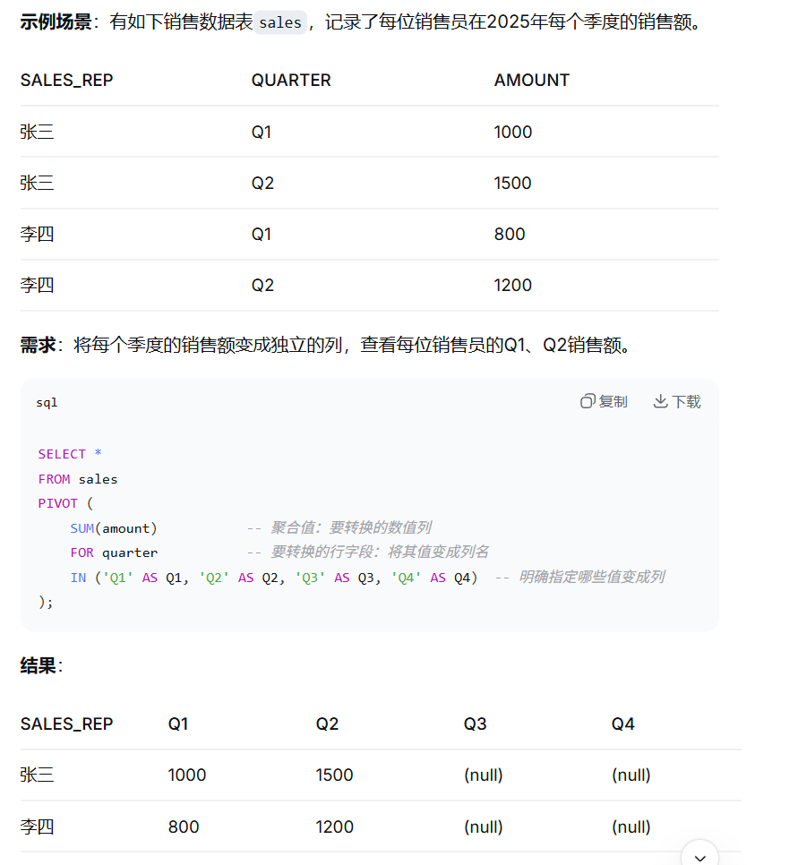
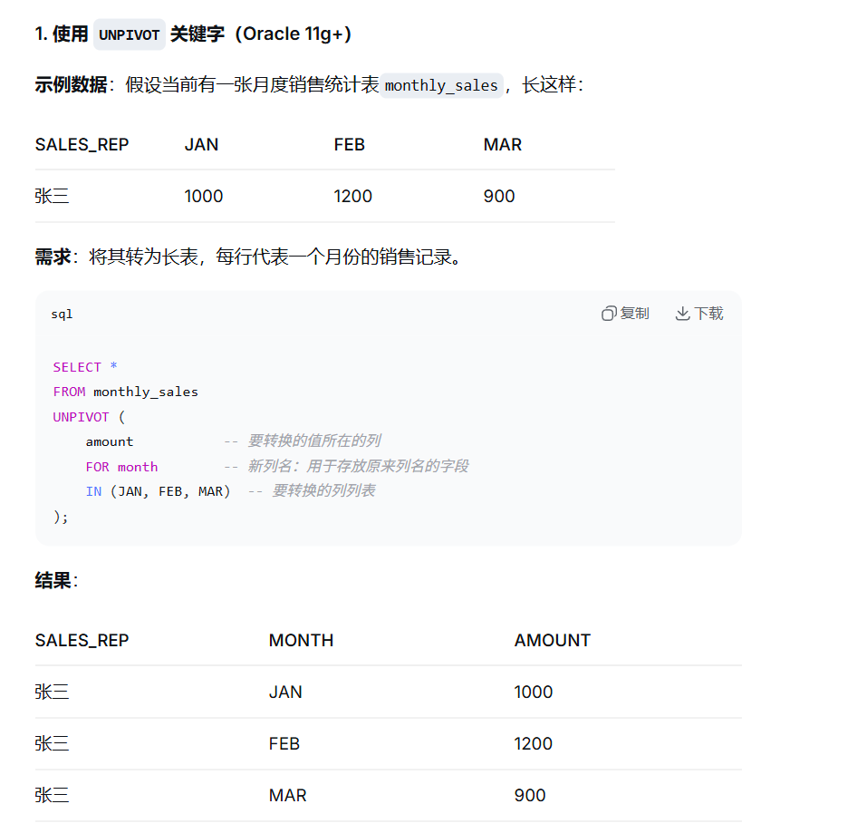

# 1. Oracle

Oracle数据库功能比MySQL更强大，支持大量功能，更保证数据一致性、安全性和性能。

# 2. 基础SQL

SQL种类和MySQL类似。

## 1. DDL

定义数据库SQL，有CREATE，ALTER，DROP，TRUNCATE，用于操作库和表。

## 2. DML

操作数据SQL，有INSERT，UPDATE，DELETE，MERGE，用于操作表的行数据。

## 3. DQL

查询数据。有SELECT，用于查询表的数据。

## 4. TCL

事务控制。有COMMIT，ROLLBACK，SAVEPOINT。

## 5. DCL

权限控制。有GRANT，REVOKE。

```mysql
-- 创建表
CREATE TABLE employee (
    emp_id      NUMBER PRIMARY KEY,
    emp_name    VARCHAR2(50) NOT NULL,
    dept_id     NUMBER,
    salary      NUMBER(10, 2),
    hire_date   DATE DEFAULT SYSDATE,
    status      VARCHAR2(20)
);

-- 插入数据
INSERT INTO employee(emp_id, emp_name, dept_id, salary)
VALUES (1, 'Tom', 10, 8000);

-- 修改数据
UPDATE employee
SET salary = salary + 1000
WHERE emp_id = 1;

-- 删除数据
DELETE FROM employee
WHERE emp_id = 1;

-- 提交事务
COMMIT;

-- 回滚事务
ROLLBACK;
```

# 3. 数据类型

| 类型         | 说明                         |
| ------------ | ---------------------------- |
| NUMBER(p, s) | 数字，p是总位数，s是小数尾数 |
| VARCHAR2(n)  | 可变长字符串                 |
| CHAR(n)      | 固定长字符串                 |
| DATE         | 日期时间                     |
| TIMESTAMP    | 时间戳                       |
| CLOB         | 大文本                       |
| BLOB         | 二进制大文本                 |
| RAW          | 原始二进制数据               |

```mysql
CREATE TABLE orders (
    order_id      NUMBER(20) PRIMARY KEY,
    user_id       NUMBER(20) NOT NULL,
    order_no      VARCHAR2(64) NOT NULL,
    amount        NUMBER(12, 2) NOT NULL,
    status        VARCHAR2(20) NOT NULL,
    created_time  TIMESTAMP DEFAULT SYSTIMESTAMP,
    updated_time  TIMESTAMP
);
```

# 4. 索引类型

| 索引类型   | 使用场景         |
| ---------- | ---------------- |
| B-Tree索引 | 高选择性字段     |
| 唯一索引   | 保证字段唯一     |
| 联合索引   | 多字段联合查询   |
| 函数索引   | 对表达式建立索引 |
| 位图索引   | 用于数据仓库     |
| 全文索引   | 用于Text文本     |

# 5. 视图

视图是基于SQL定义的逻辑表。不存储数据，而是一个命名的查询数据。如果查询视图，那么就会执行预定义好的SELECT语句，返回结果。

```mysql
CREATE OR REPLACE VIEW v_emp_dept AS
SELECT
    e.emp_id,
    e.emp_name,
    d.dept_name,
    e.salary
FROM employee e
JOIN department d ON e.dept_id = d.dept_id;
```

> 定义了视图v_emp_dept。这个视图就代表了AS之后的SQL。

```mysql
SELECT *
FROM v_emp_dept
WHERE salary > 10000;
```

这样，上面执行的这个SQL就会变成下面的SQL。

```mysql
SELECT e.emp_id, e.emp_name, d.dept_name, e.salary
FROM employee e
JOIN department d ON e.dept_id = d.dept_id
WHERE e.salary > 10000;  -- 外部的过滤条件被“下压”到了内部
```

这种视图的作用是封装复杂SQL，上层能够直接调用。并且可以实现权限控制，为不同的用户给出不同的视图，控制字段访问。还有对外隐藏了内部的表结构。

## 1. 关系视图

上面定义的就是关系视图。将视图的SQL语句与执行的查询语句合并，并将查询语句的条件放到最下面，然后从数据库中查询数据。

因为关系视图只存储简单的命令，几乎不占用磁盘空间，且执行时才会查询，这样能够保证数据的可见性，并能隐藏表的敏感字段，或者将多表JOIN的逻辑封装起来。

但如果视图的SQL非常复杂，那么每次查询时，都会将复杂的逻辑执行一遍，在高并发时性能下降。

## 2. 物化视图

物化视图是一个物理表。保存了查询的逻辑，同时会执行一次查询，将得到的结果写到表中。

这相当于缓存表，查询物化视图的时候，数据库会从物化视图的表中进行查询。由于在使用物化视图查询的时候不需要查询数据库，且只在已经筛选好的数据上进行查询，所以速度很快。

但物化视图缓存了视图SQL的数据，如果数据库发生改变，主要由四种方法能够实现更新。

1. ON COMMIT。数据库出现了COMMIT时，物化视图会自动刷新。
2. ON DEMAND。由开发人员或者定时任务手动刷新。
3. FAST。通过物化视图日志，将数据表上次刷新以来的变化同步过来，配合ON DEMAND使用。
4. COMPLETE。将物化视图的数据清空，重新执行一次物化视图。

这种视图在面对大数据的时候，能够将原本非常耗时的SQL缩短到非常短的事件。但由于需要缓存数据，物化视图是需要额外的磁盘空间的。且除了ON COMMIT提交时刷新，否则会出现短暂的数据不一致情况。

# 6. Sequence

在MySQL中，通过配置AUTO_INCREMENT能够在添加数据时自动设置递增值。

在Oracle中，没有自动递增，而是需要通过Sequence来获取自增值。

```mysql
CREATE SEQUENCE seq_employee
START WITH 1
INCREMENT BY 1
CACHE 100
NOCYCLE;
```

```mysql
INSERT INTO employee(emp_id, emp_name, dept_id, salary)
VALUES (seq_employee.NEXTVAL, 'Alice', 10, 9000);
```

> START WITH 1表示计数器从1开始。
>
> INCREMENT BY 1表示每次调用时数字自增1。
>
> CACHE表示Oracle一次性获取100个计数器数字，后续插入请求时能够直接从这个缓存中获取自增值，不需要经过磁盘IO获取。
>
> 通过seq_employee.NEXTVAL能够获取当前自增值，并将计数器自增为2。

# 7. Synonym

Synonym是同义词，为数据库对象起别名。

```mysql
CREATE SYNONYM emp FOR hr.employee;
```

这样，就能使用emp来表示hr.employee表了。

```mysql
SELECT * 
FROM emp;

-- 等价于
SELECT * 
FROM hr.employee;
```

其中，同义词分为私有同义词和公共同义词。

私有同义词属于特定用户，其他用户无法看到和使用。

公共同义词需要创建时用PUBLIC在SYNONYM前修饰。所有用户都可以访问。

# 8. 子查询

子查询可以用于SELECT、FROM、WHERE、HAVING中。

## 1. 标量子查询

能够返回单个值。

```mysql
SELECT
    e.emp_name,
    e.salary,
    (SELECT d.dept_name
     FROM department d
     WHERE d.dept_id = e.dept_id) AS dept_name
FROM employee e;
```

这里查询到单个数据。相当于得到d.dept_name为具体数据，如"金融部"，那么子查询结束后，外部查询的逻辑变为下面的样子。

```mysql
SELECT
    e.emp_name,
    e.salary,
    "金融部" AS dept_name
FROM employee e;
```

## 2. IN子查询

```mysql
SELECT *
FROM employee
WHERE dept_id IN (
    SELECT dept_id
    FROM department
    WHERE dept_name IN ('研发部', '产品部')
);
```

# 9. CTE

CTE是Common Table Expression，公用表表达式。一个历史的，只在当前SQL语句执行期间的命名结果集。通过WITH能够从多个表中获取字段和行数据拼接成表，能够使用这些临时表来进行查询。

```mysql
WITH high_salary_emp AS (
    SELECT *
    FROM employee
    WHERE salary > 10000
),
dept_stat AS (
    SELECT
        dept_id,
        COUNT(*) AS emp_count,
        AVG(salary) AS avg_salary
    FROM high_salary_emp
    GROUP BY dept_id
)
SELECT
    d.dept_name,
    s.emp_count,
    s.avg_salary
FROM dept_stat s
JOIN department d ON s.dept_id = d.dept_id;
```

这能够拆解复杂SQL，增强了可读性。

但WITH执行的表查询不会物化，而是在每次执行时都需要查询其他表构成临时表。因此CTE的性能比较差

# 10. 递归查询

Oracle的层级结构包含组织架构、菜单树、分类树、地区树等。

主要有两种方法。

1. CONNECT BY。
2. 递归CTE。

## 1. CONNECT BY

```mysql
SELECT
    LEVEL AS level_no,
    emp_id,
    emp_name,
    manager_id
FROM employee
START WITH manager_id IS NULL
CONNECT BY NOCYCLE PRIOR emp_id = manager_id;
```

这里START WITH定义了哪些行是树的根节点。CONNECT BY定义父子连接关系。PRIOR表示后面的emp_id = manager_id是从父行到子行的遍历方向。即如果A行数据的emp_id为1，B行数据的manager_id为1，那么A行数据是父行，B行数据是子行。

通过NOCYCLE可以避免循环引用导致的无限递归。

比如查询员工ID为100的员工及其所有下属。

```mysql
SELECT 
    LEVEL,                          -- 伪列，表示当前行所在的层级，根为1
    employee_id,
    emp_name,
    manager_id,
    LPAD(' ', 2 * (LEVEL - 1)) || emp_name AS tree_path  -- 用缩进显示层级
FROM employees
START WITH employee_id = 100        -- 从指定员工开始
CONNECT BY PRIOR employee_id = manager_id  -- 上级的员工ID = 当前行的经理ID
ORDER SIBLINGS BY emp_name;         -- 同层按姓名排序
```

这样，通过LEVEL能够查看到当前行的层级。

## 2. 递归CTE

同样是查询员工ID为100的员工以及所有下属。

```mysql
WITH emp_tree (employee_id, emp_name, manager_id, emp_level) AS (
    -- 锚点：先找到根节点（员工100）
    SELECT 
        employee_id, 
        emp_name, 
        manager_id, 
        1 AS emp_level
    FROM employees
    WHERE employee_id = 100
    
    UNION ALL
    
    -- 递归：找到直接下属
    SELECT 
        e.employee_id, 
        e.emp_name, 
        e.manager_id, 
        t.emp_level + 1
    FROM employees e
    JOIN emp_tree t ON e.manager_id = t.employee_id  -- 当前行的经理 = 上一层的员工
)
SELECT * FROM emp_tree
ORDER BY emp_level, emp_name;
```

# 11. 窗口函数

窗口函数能够对一组相关的行进行聚合、排名或者计算。


例如每个部门工资排名。

```mysql
SELECT
    emp_id,
    emp_name,
    dept_id,
    salary,
    ROW_NUMBER() OVER (
        PARTITION BY dept_id
        ORDER BY salary DESC
    ) AS rn
FROM employee;
```

查询每个部门工资最高的员工。

```mysql
SELECT *
FROM (
    SELECT
        e.*,
        ROW_NUMBER() OVER (
            PARTITION BY dept_id
            ORDER BY salary DESC
        ) AS rn
    FROM employee e
)
WHERE rn = 1;
```

# 12. 分页查询

分页查询以前经常用ROWNUM。ROWNUM是为结果集分配的逻辑行号，搜到多少行数据，ROWNUM最大就是多少。

```mysql
SELECT *
FROM (
    SELECT
        t.*,
        ROWNUM AS rn
    FROM (
        SELECT *
        FROM orders
        ORDER BY created_time DESC
    ) t
    WHERE ROWNUM <= 30
)
WHERE rn > 20;
```

其中，ROWNUM <= 30表示读取到当前页的最后一行，30 = page_size × page_number。

内部查询到前30行数据，然后外部通过rn>20来读取21-30的数据。

新的分页查询可以通过OFFSET ... FETCH语法来查询。

```mysql
SELECT emp_id, emp_name, salary
FROM employees
WHERE status = 'ACTIVE'
ORDER BY salary DESC
OFFSET 20 ROWS          -- 跳过前20行
FETCH NEXT 10 ROWS ONLY; -- 取接下来的10行
```

# 13. 行列转换

行列转换可以通过PIVOT和UNPIVOT来实现。





# 14. MERGE INTO

这是有则更新，无则插入的语句。

能够用一条SQL完成查找和修改两个操作。

```mysql
MERGE INTO target_table t          -- 目标表
USING source_table s               -- 源表/子查询
ON (t.key_column = s.key_column)   -- 匹配条件（通常为主键或唯一键）
WHEN MATCHED THEN                  -- 匹配上：更新
    UPDATE SET t.column1 = s.column1,
               t.column2 = s.column2
    [WHERE ...]                    -- 可选：更新时的额外过滤条件
    [DELETE WHERE ...]             -- 可选：更新后删除符合条件的行（Oracle特有）
WHEN NOT MATCHED THEN              -- 不匹配：插入
    INSERT (t.column1, t.column2, ...)
    VALUES (s.column1, s.column2, ...)
    [WHERE ...];                   -- 可选：插入时的额外过滤条件
```

## 15. CASE WHEN

条件表达式。

```mysql
SELECT
    emp_id,
    emp_name,
    salary,
    CASE
        WHEN salary >= 20000 THEN '高薪'
        WHEN salary >= 10000 THEN '中薪'
        ELSE '普通'
    END AS salary_level
FROM employee;
```

# 16. PL/SQL

PL/SQL是在SQL的基础上，添加了编程语言的流程。如条件、循环、变量等。

```mysql
CREATE OR REPLACE PROCEDURE update_emp_salary (
    p_emp_id IN NUMBER,
    p_amount IN NUMBER
) AS
BEGIN
    UPDATE employee
    SET salary = salary + p_amount
    WHERE emp_id = p_emp_id;

    COMMIT;
EXCEPTION
    WHEN OTHERS THEN
        ROLLBACK;
        RAISE;
END;
/
```

主要包含三部分。

1. DECLARE。用于声明变量。
2. BEGIN。流程逻辑。
3. EXCEPTION。异常处理。

这样，能够像调用函数那样调用PL/SQL就可以执行SQL语句。

```mysql
BEGIN
    update_emp_salary(1, 1000);
END;
/
```

# 17. 触发器

触发器是在表发生DML语句是自动执行的代码。

```mysql
CREATE [OR REPLACE] TRIGGER trigger_name
    {BEFORE | AFTER | INSTEAD OF}          -- 时机
    {INSERT | UPDATE | DELETE} ON table_name  -- 事件和对象
    [FOR EACH ROW]                         -- 行级（省略则为语句级）
    [WHEN (condition)]                     -- 触发条件（可选）
DECLARE
    -- 声明变量（可选）
BEGIN
    -- 触发器逻辑代码（PL/SQL）
    :NEW.column_name  -- 引用新值（INSERT/UPDATE后）
    :OLD.column_name  -- 引用旧值（DELETE/UPDATE前）
EXCEPTION
    -- 异常处理（可选）
END;
/
```

例如自动维护更新时间。

```mysql
CREATE OR REPLACE TRIGGER trg_employee_update_time
BEFORE UPDATE ON employee
FOR EACH ROW
BEGIN
    :NEW.updated_time := SYSTIMESTAMP;
END;
/
```

# 18. 事务

Oracle的事务能够通过COMMIT或者ROLLBACK来结束。

与MySQL最大的不同是，执行第一个DML的时候，事务自动开启。需要手动COMMIT或者ROLLBACK后，才会提交事务。

由于Oracle最大的特点是不使用读锁。读取数据的时候，会使用MVCC开启快照来读取数据，不会阻塞写操作，不会有读锁。正因为如此，Oracle认为MVCC已经实现了读不加锁，且读到的永远是已提交数据，所以没必要采用可重复读的隔离级别。默认且最高的隔离级别是读已提交。

# 19. 执行计划

通过EXPLAIN PLAN FOR + SQL能够查看当前SQL的执行情况。

```mysql
EXPLAIN PLAN FOR
SELECT e.emp_name, d.dept_name
FROM employees e
JOIN departments d ON e.dept_id = d.dept_id
WHERE e.salary > 10000;
```

标准的执行计划如下。

```mysql
-------------------------------------------------------------------------------
| Id  | Operation                     | Name         | Rows  | Bytes | Cost |
-------------------------------------------------------------------------------
|   0 | SELECT STATEMENT              |              |     1 |    32 |    4 |
|   1 |  NESTED LOOPS                |              |     1 |    32 |    4 |
|   2 |   TABLE ACCESS BY INDEX ROWID| EMPLOYEES    |     1 |    18 |    2 |
|*  3 |    INDEX RANGE SCAN          | EMP_SALARY_IDX|     1 |       |    1 |
|   4 |   TABLE ACCESS BY INDEX ROWID| DEPARTMENTS  |     1 |    14 |    2 |
|*  5 |    INDEX UNIQUE SCAN         | DEPT_PK      |     1 |       |    1 |
-------------------------------------------------------------------------------
```

在这里，如果出现TABLE ACCESS BY FULL，说明没有走索引，出现了全表扫描。

TABLE ACCESS BY INDEX ROWID说明通过索引并回表。

还有INDEX UNIQUE SCAN唯一索引，INDEX RANGE SCAN索引范围扫描等。

还有Rows，能够估算扫描行数，Cost表示成本，Name表示操作的表名或者索引名。

# 20. 优化器

Oracle主要使用CBO，基于成本的优化器。

优化器能够决定是否使用索引、用哪个索引、Join顺序等。

它有两个模块。

1. 查询转换器。尝试重写SQL，在不改变结果的前提下转换成更高效的形式。
2. 估算器。能够计算选择性、基数和成本。选择性表示查询条件能够过滤多少比例的数据，技术表示每一步预计返回数据的行数，成本是最终的综合评分，目的是找出成本最低的执行路径。

影响优化器决策的因素有很多。如系统统计信息，反应CPU或者IO吞吐量的能力，能够让CBO更准确地估算成本。还有统计信息的新鲜度，如果数据库改变，但统计信息未同步，就会影响决策。

# 21. SQL改写

SQL改写能够大幅提高SQL执行性能。

1. 避免对索引列使用函数。

```mysql
SELECT *
FROM orders
WHERE TO_CHAR(created_time, 'YYYY-MM-DD') = '2024-06-01';
```

上面使用了TO_CHAR函数，会导致索引失效。因此，需要将查询条件改为范围查询。

```mysql
SELECT *
FROM orders
WHERE created_time >= DATE '2024-06-01'
  AND created_time <  DATE '2024-06-02';
```

或者创建函数索引。

2. 类型转换。

```mysql
SELECT *
FROM orders
WHERE order_id = '10001';
```

如果order_id为NUMBER类型，那么字符串会触发隐式类型转换导致索引失效。

3. 前通配符。

通过'%TOM'之类的LIKE查询会导致索引失效。

4. OR改写。

简单的OR可以改写为IN。

5. 不要使用`SELECT *`。

大部分情况并不需要所有数据，最好按照联合索引，或者按需使用数据。

6. 慢SQL。

```
1. 确认慢 SQL 的 SQL_ID
2. 查看执行计划
3. 查看实际执行统计
4. 分析访问路径
5. 分析 Join 顺序和 Join 方法
6. 检查统计信息是否准确
7. 检查索引是否合理
8. 检查是否存在隐式转换、函数、低效分页
9. 判断是否需要 SQL 改写
10. 判断是否需要分区、并行、物化视图、归档
```

# 22. Hint

Hint是给优化器的建议，能够让优化器选择使用索引、指定Join等。

```sql
SELECT /*+ INDEX(e idx_emp_dept_id) */
       *
FROM employee e
WHERE dept_id = 10;

SELECT /*+ USE_NL(e d) */
       *
FROM employee e
JOIN department d ON e.dept_id = d.dept_id;
```

而Hint的正确顺序应该是先检查SQL写法，然后统计信息、索引、数据分布、执行计划，最后才考虑Hint。

# 23. 本地索引和全局索引

Oracle默认使用全局索引。

如果要指定，需要在创建索引时使用LOCAL或者GLOBAL。

```mysql
-- 在 product_id 列上创建本地索引
CREATE INDEX idx_local_product_id ON sales (product_id) LOCAL;

-- 在 customer_id 列上创建全局非分区索引（最常见的全局索引）
CREATE INDEX idx_global_customer_id ON sales (customer_id) GLOBAL;
```

本地索引和全局索引主要的区别就是索引结构是否与表的分区一一对应。

本地索引与分区一一对应。

例如orders表被分成四个分区。

```sql
CREATE TABLE orders (
    order_id    NUMBER,
    order_date  DATE,
    customer_id NUMBER
)
PARTITION BY RANGE (order_date) (
    PARTITION p_2023_q1 VALUES LESS THAN (TO_DATE('2023-04-01','YYYY-MM-DD')),
    PARTITION p_2023_q2 VALUES LESS THAN (TO_DATE('2023-07-01','YYYY-MM-DD')),
    PARTITION p_2023_q3 VALUES LESS THAN (TO_DATE('2023-10-01','YYYY-MM-DD')),
    PARTITION p_2023_q4 VALUES LESS THAN (TO_DATE('2024-01-01','YYYY-MM-DD'))
);
```

按照每个季度，表数据被分成了四个分区。

如果建立了本地索引，那么Oracle会为每一个物理分区构建单独的索引结构。

```sql
CREATE INDEX idx_local_customer ON orders (customer_id) LOCAL;
```

也就是说，p_2023_q1有一个idx_local_customer索引，q_2023_q2也有一个idx_local_customer索引，以此类推。

那么在`WHERE order_date BETWEEN ... AND customer_id = ...`的时候，会首先通过分区查看order_date确定需要扫描哪几个分区，然后只需要去这几个分区查找指定的customer_id。

如果使用全局索引，那么就会创建一个不分区的整体索引结构。

```sql
CREATE INDEX idx_global_customer ON orders (customer_id) GLOBAL;
```

如果查询条件是`WHERE customer_id = 12345`，就会使用这个索引在整个表中快速查找，是否分区与它无关。

这样的话，如果删除了某个分区，本地索引只需要删除掉那个分区的索引即可。但全局索引会不可用，因为全局索引中，部分节点被删除了，只能重建。

# 24. 大表优化

如果数据表的数据过大，需要进行优化。

1. 分区。通过分区，能够在查询时首先定位到目标分区，在分区的小数据中进行查询。
2. 索引。可以构建本地索引或者全局索引。
3. SQL改写。避免索引失效。
4. 物化视图。构建物化视图能够在查询时直接在视图缓存的数据中进行查询。
5. 批处理。对大量更新删除操作进行批处理。

# 25. 面试小问题

1. 什么是绑定变量

绑定变量是在SQL中通过占位符来代替具体的常量值。

```sql
SELECT * FROM employees WHERE employee_id = 100;
```

可以用变量来代替。

```sql
SELECT * FROM employees WHERE employee_id = :emp_id;
```

在执行的时候，可以将具体的值传入。

这种绑定变量能够防止SQL注入。

2. 用户和Schema的关系是什么

用户是一个数据库账号，Schema就是模式，是一个容器，用来存放与这个用户相关的所有数据库对象。在访问数据库的时候，需要加上用户名来表示是哪个用户下的数据库。

3. 表空间、数据文件、段、区、块是什么关系

```
数据库 (Database)
    └── 表空间 (Tablespace)          -- 逻辑上的“大仓库”
            └── 数据文件 (Datafile)   -- 物理上的“硬盘文件”
                    └── 段 (Segment)  -- 存放特定对象的“集装箱”
                            └── 区 (Extent) -- 一组连续的“货架”
                                    └── 块 (Block)  -- 最基础的“格子”，读写的最小单位
```

块是最小的IO单元，每次读取写入数据的时候，就是以块为单位来操作的。

区是分配单元，由一组连续的块组成的单元。

段是一个数据库对象拥有的所有区的集合，基本单位是区，区是段分配空间的最小单位。也就是说，一个数据库就是一个段。

数据文件是数据库的存储文件。

表空间是Oracle的最大存储容器，将多个数据文件组织成逻辑整体。

向一张表插入一行数据的过程如下。

数据库找到表对应的表空间。

表空间定位到数据文件。

数据库检查表对应的段，看是否有空闲的区可以写入。

如果区满，就分配新的区。

最后数据写入到某个空闲块中。

4. 空字符串和NULL的关系

在Oracle中，空字符串和NULL等价。

5. 主键、唯一约束、唯一索引的区别

主键和唯一约束是一种逻辑上的约束。

主键创建的时候，会自动创建同名的唯一索引。

唯一约束也会自动创建同名的唯一索引，用来保证字段的唯一性。

唯一索引是一种物理上的约束，会创建索引树，用来加速查询性能。

6. Sequence跳号

Sequence有Cache字段，这个字段用于使用时一次性取出一定量的自增值，这样下一次取的时候能够从缓存中取，提高性能。但如果数据库宕机或者重启，缓存就会失效，下一次取会从上一次取出的自增值继续取出一定量到缓存中，这样就导致上一次缓存没有使用的自增值失效，出现跳号。

7. WHERE和HAVING的区别

WHERE和HAVING都是用于过滤的。但优先级中的顺序是WHERE、GROUP BY、HAVING。这样，WHERE就会先过滤，再分组。而HAVING会先分组，然后再过滤。

8. IN和EXISTS的区别

IN和EXISTS都用于子查询来过滤关键字。

```sql
SELECT * FROM employees 
WHERE dept_id IN (SELECT dept_id FROM departments WHERE location = 'New York');
```

这里使用IN的时候，会优先执行子查询。

执行子查询得到dept_id结果集，然后再执行外查询。

这种适合子查询结果集较小的情况。

```sql
SELECT * FROM employees e
WHERE EXISTS (SELECT 1 FROM departments d 
              WHERE d.dept_id = e.dept_id AND d.location = 'New York');
```

这里首先会执行外查询。将employees的所有数据行查出来，然后对每个数据行执行内部的子查询。

如果employees总共有n行，那么内查询会执行n次。

这种适合外表很大，子查询只需要判断是否关联的场景。

但NOT IN中，如果子查询包含NULL，由于NULL与NULL比较是UNKNOWN，于是查询会返回空集。需要通过IS NOT NULL来排除。

但NOT EXISTS就不会有这个问题。

9. 如何查询每组TOP N

可以通过ROW_NUMBER()实现。

```sql
WITH ranked AS (
    SELECT 
        e.*,
        ROW_NUMBER() OVER (PARTITION BY department_id ORDER BY salary DESC) AS rn
    FROM employees e
)
SELECT *
FROM ranked
WHERE rn <= 3;   -- 取每组前3名
```

这里按department_id分组，组内按照salary降序排列，通过ROW_NUMBER()为每组的行分配从1开始的连续序号，外层查询过滤ROW_NUMBER <N即可。

10. 如何分页

可以设置OFFSET和FETCH NEXT来实现。

```sql
SELECT emp_id, emp_name, salary
FROM employees
WHERE status = 'ACTIVE'
ORDER BY salary DESC
OFFSET 20 ROWS          -- 跳过前20行
FETCH NEXT 10 ROWS ONLY; -- 取接下来的10行
```

11. MERGE INTO

MERGE INTO是有则更新，无则插入。

```sql
MERGE INTO target_table t          -- 目标表
USING source_table s               -- 源表/子查询
ON (t.key_column = s.key_column)   -- 匹配条件（通常为主键或唯一键）
WHEN MATCHED THEN                  -- 匹配上：更新
    UPDATE SET t.column1 = s.column1,
               t.column2 = s.column2
    [WHERE ...]                    -- 可选：更新时的额外过滤条件
    [DELETE WHERE ...]             -- 可选：更新后删除符合条件的行（Oracle特有）
WHEN NOT MATCHED THEN              -- 不匹配：插入
    INSERT (t.column1, t.column2, ...)
    VALUES (s.column1, s.column2, ...)
    [WHERE ...];                   -- 可选：插入时的额外过滤条件
```

12. 定位慢SQL

通过AWR，Automatic Workload Repository能够查看过去一段时间哪些SQL最耗资源。

找到对应SQL后，需要查看执行计划，通过EXPLAIN PLAN FOR来执行。

```sql
-------------------------------------------------------------------------------
| Id  | Operation                     | Name         | Rows  | Bytes | Cost |
-------------------------------------------------------------------------------
|   0 | SELECT STATEMENT              |              |     1 |    32 |    4 |
|   1 |  NESTED LOOPS                |              |     1 |    32 |    4 |
|   2 |   TABLE ACCESS BY INDEX ROWID| EMPLOYEES    |     1 |    18 |    2 |
|*  3 |    INDEX RANGE SCAN          | EMP_SALARY_IDX|     1 |       |    1 |
|   4 |   TABLE ACCESS BY INDEX ROWID| DEPARTMENTS  |     1 |    14 |    2 |
|*  5 |    INDEX UNIQUE SCAN         | DEPT_PK      |     1 |       |    1 |
-------------------------------------------------------------------------------
```

查看Operations中是否有是否有TABLE ACCESS BY FULL，说明进行了全盘扫描以及看Rows，如果过大，说明查找的数据行过多，也可以优化。